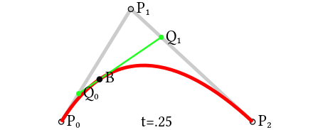
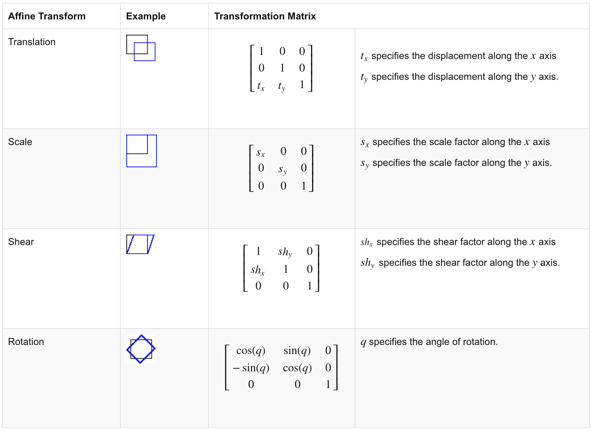

# iOS 애니메이션

- 적절한 애니메이션은 사용자에게 유용한 피드백을 준다.
- 과도한 애니메이션은 사용성을 저해한다.

## 이미지와 색이론

**이미지 : Bitmap (Pixel Storage map)**

- 픽셀 요소들을 저장하는 맵
- 점을 기반으로 하는 이미지 형식
- png, jpg … etc 비트맵 기반 이미지 확장자
  - 원본 비트맵의 압축 방식에 따라 png, jpg 등으로 나뉨
  - png는 무손실 압축, jpg는 손실압축
    

**DIB (Device independnt Bitmap)**

- device에 상관없이 출력할 수 있는 비트맵 형식을 말한다.

**24-bit Lena**

- 흑백은 픽셀하나에 1 byte로 표현이 가능 (검정—회색—흰색 : 2^8= 256 )
- color는 RGB 각각 256 ==> **3 bytes == 24 bit**

- 요새는 RGBA(alpha, 투명도) == 4 bytes == 32 bit

- 즉, 이미지의 한 픽셀을 표현하는데 4 bytes가 필요하다.

**RGB vs CMYK**

> 화면에 display할 때는 가산혼합인 RGB를 쓰고, 
>
> 인쇄출력시에는 감산혼합인 CMYK(Cyan, Magenta, Yellow, blacK)를 사용한다.

- 섞일수록 밝아지는 RGB와 구분되어, CMYK는 섞일수록 어두워지는 특성이 있다.
- magenta+cyan = blue
- magenta + yellow = red
- yellow + cyan = green

- k == black

## 좌표와 Curve

### 좌표계

- macOS는 1사분면, iOS는 4사분면(flipped 1사분면)을 쓴다. (x,y = 0,0 이 좌상단)

### Curve

- 수학적으로는 직선도 커브

**Bezier Curve**

> n개의 점으로부터 얻어지는 n-1차 곡선

- 직선 : 1초동안 다른 점을 경유하지 않고, 점A에서 점B까지 이동을 하는 최단 경로
- 곡선 : Control Point(P1)을 두고, P0(A)에서 P1로 1초간 이동할 때, 마찬가지로 P1에서 P2(B)로 이동할 때, 그 두 이동점 사이의 거리를 시간에 따라 비율적으로 표현하는 방식으로 곡선을 생성
- 점을 이어서 경로를 만든다.

## UIView Property

https://developer.apple.com/documentation/uikit/uiviewpropertyanimator

- 단순히 view frame 값을 다른 좌표로 변화하면 이전좌표 -> 다음좌표가 되나, Animation 처리시 이동경로에 따라 변화하는 모습을 연속적으로 출력한다.

아래의 요소들을 변화시키면 UIView 화면을 다시 그린다.

### Frame

- Frame은 **Origin** Point와 **size**(width, height)를 통해 만드는 사각형 형태의 도형이다.
- Frame 내부 좌표는 상대좌표로, window의 origin과 frame의 origin에 대한 보정이 이뤄진다.

### Center

- frame의 중심좌표 

### Alpha(투명도)

- 통상 0.1 이하는 무시될 수 있다.

### Background Color

- frame의 배경색

### Affine Transform

 점, 직선 및 평면을 유지하는 선형 매핑 방법. 평행한 선들은 평행 상태를 유지함

- identity : identity transform을 하면 원래의 frame 상태로 돌아옴
- scale : Scale transform을 하면 frame의 확대/축소 
- Transition : 원래 frame의 좌표를 이동
- Rotate : 원래 frame의 좌표를 anchor point 기준(보통은 center점)으로 회전

출처 : https://www.mathworks.com/discovery/affine-transformation.html

## Easing - Timing Function

- 60 fps = 60 frame per second (1/60초마다 화면을 새로 그림)
- Timing Function에 따라 애니메이션효과가 달라진다
  - 균등하게 시간을 나누면 ? y=x
  - 가속모드 ? y= x^c 
  - 감속모드 ? y = log x or sqrt( x )
  - 파동함수 

## Display Link

- UIKit/AppKit은 Core Animation, Metal / Core Graphics / Graphics Hardware를 통제한다.
- `CADisplayLink`를 사용하면 화면을 얼마나 자주 그리는지에 대해 설정할 수 있다.
- 가령 animation 시킬 때, `60 frame`을 사용하려면 애니메이션 준비 동작에 대한 함수의 실행 시간이 한번의 호출에 `160ms를 초과`하면 **60 frame을 달성할 수 없다.**
  - 16줄 이상 넘어가는 코드를 사용하면 `160ms/함수호출시간` 을 달성하기 어렵다.
- https://developer.apple.com/documentation/quartzcore/cadisplaylink

## Keyframe Animation

- key에 해당하는 이미지를 여럿 만들어서 해당 이미지들을 출력하여 애니메이션 효과를 만드는 방법

  - 몇 개의 이미지만으로도 애니메이션을 만들 수 있다.

  - 동기 방식이다.

    |—|

    ​       |—|

    ​      		|—|

  - 타이밍을 빈번하게 변경하는 표현 방식(혹은 단위애니메이션끼리 겹치는 경우)에는 적용하기 힘들다.

    |—|

    ​    |—|

    ​		|—|

    

- cf.gif는 이미지 안에 frame이 여러개 들어가있는 것이다.

## UIDynamicAnimator

- 끝판왕

- view에 `중력가속도` 개념을 적용
- Gravity : 바닥방향으로 가속이동
- Collision : 바닥에 충돌
- Collision + Gravity + Spring
- Snap : 원하는 위치로 이동
- Instananeous Push : 등속도 운동
- Continuous push  : 등가속도 운동
- Pendulum : 진자운동

## ViewController Transition

- ViewController도 화면 간의 이동시에  animation 작동
- segue가 대표적
- national geographic 앱 잘 분석해보자. 3D transition 

