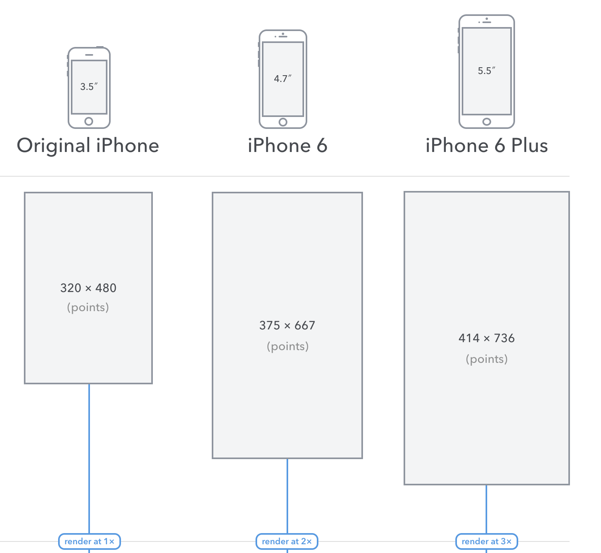
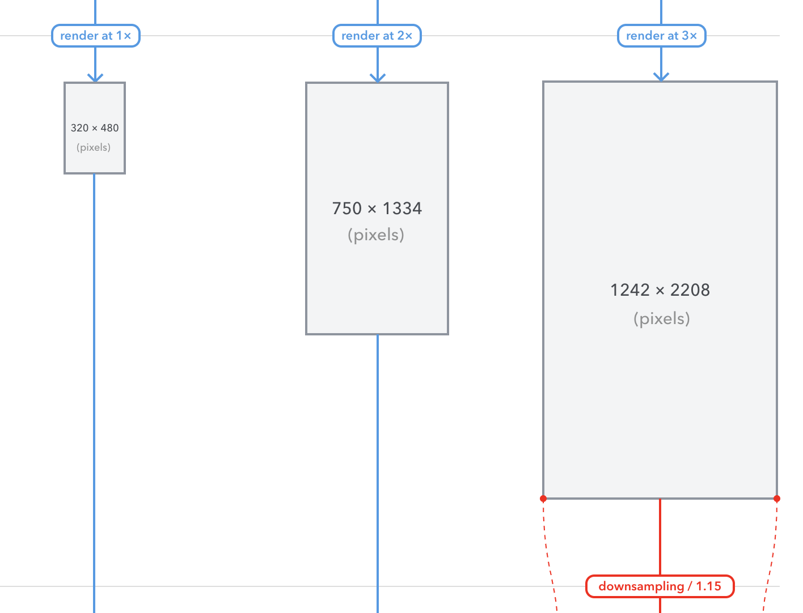
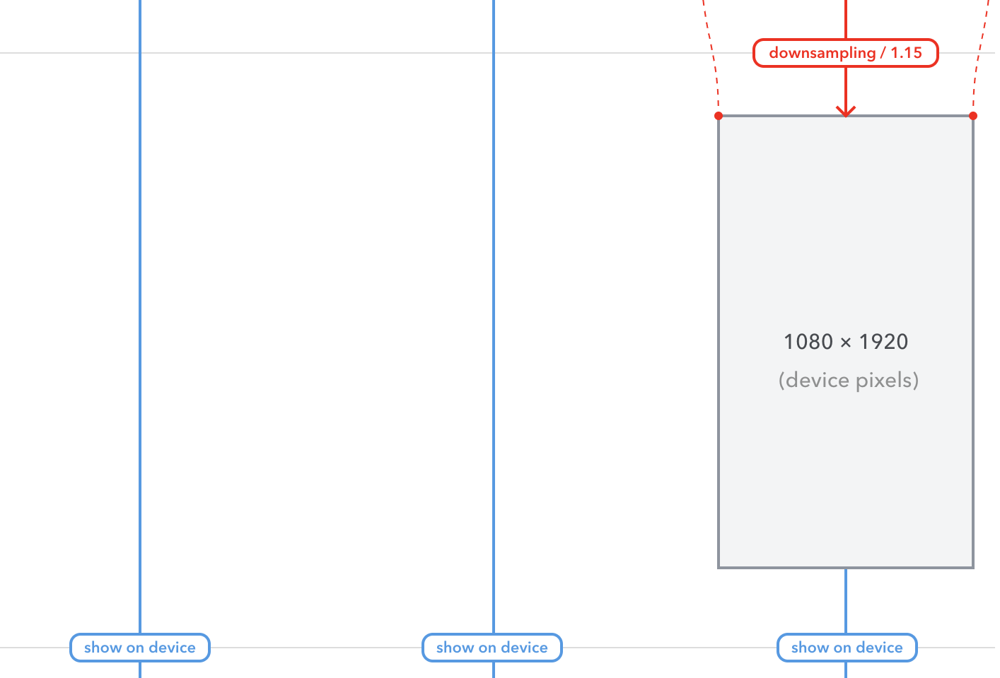
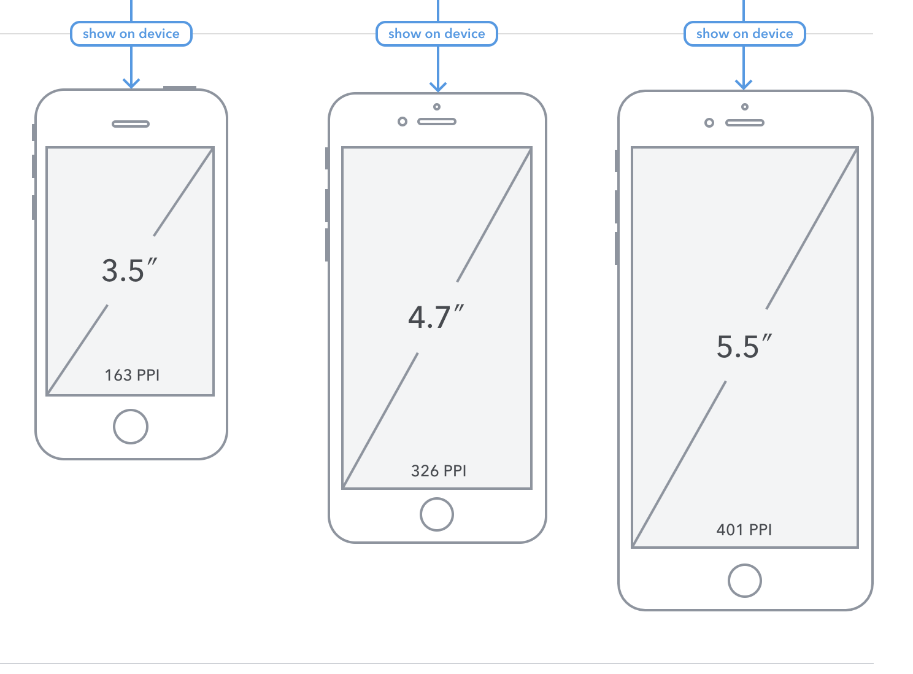
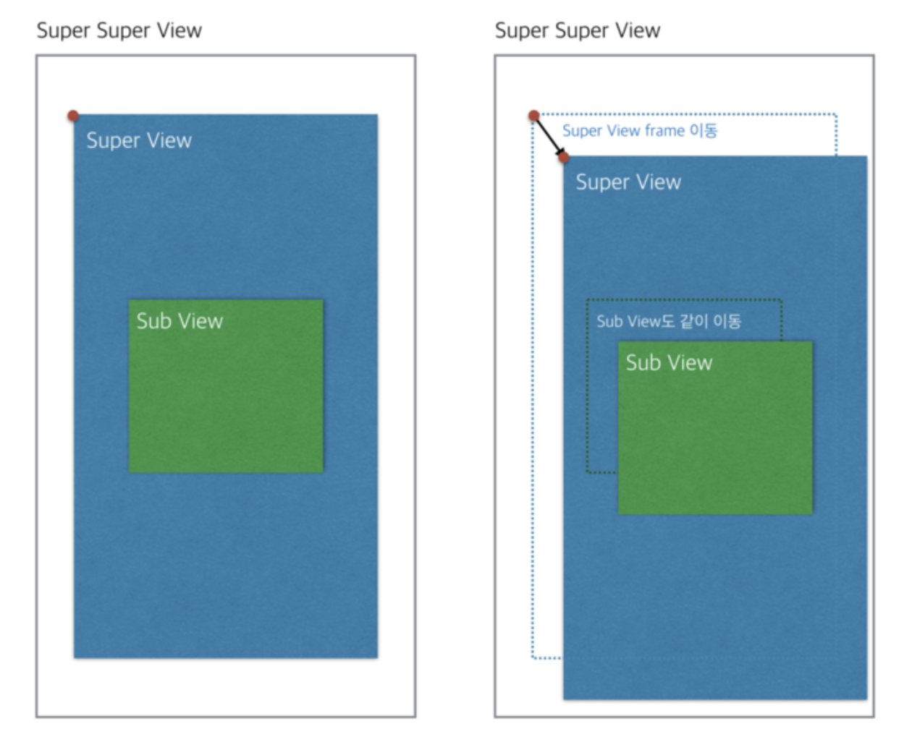
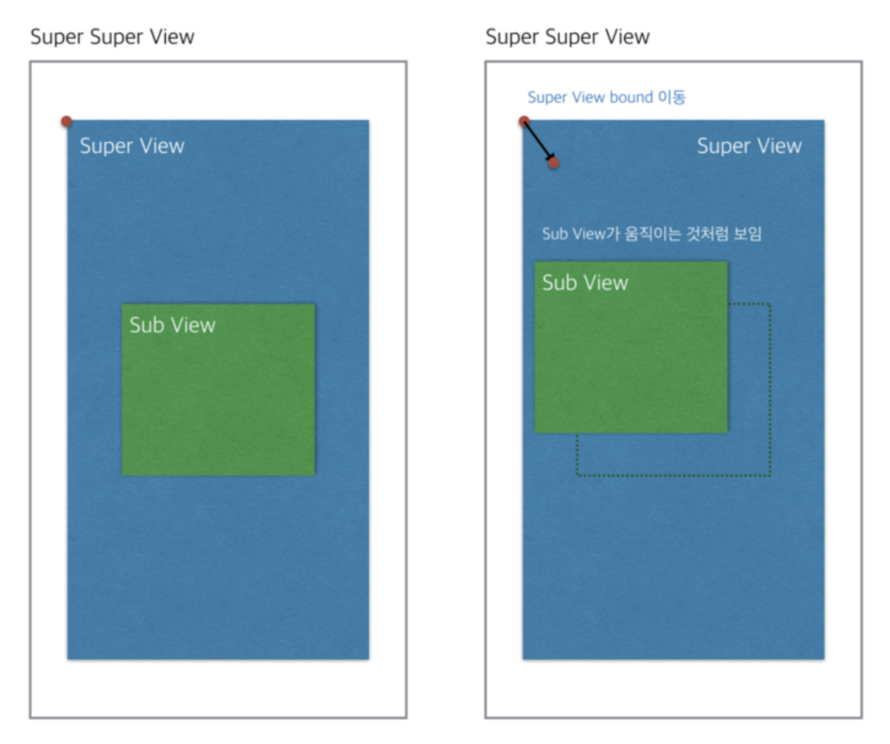

# iOS 좌표 시스템 

### Points 

- 모든 도형의 좌표들은 points 로 표기된다. 

- 포인트들은 추상적인 단위로, 수학적인 공간좌표에서 의미를 지닌다.
- 원래 아이폰에서는 points == pixels on screen 이였으나 더이상 통용되는 공식은 아니다.

### Rendered Pixels

- 포인트 기반의 도형들(drawings)는 픽셀로 렌더링된다. 
- 이 프로세스는 흔히 `rasterization` 이라 부른다. 

- 포인트 좌표들은 `scale factor (@x2)` 에 의해 배수화 (multiplied) 되어 픽셀 좌표들을 얻게 된다. 
- 높은 scale factors는 더 디테일 수준이 높은 결과를 얻는다.
- 일반적인 scale factors는 @x1, @x2, @x3 이 있다.

### Physical Pixels

- iPhone 6+ 같은 경우는 이전 단계에서 렌더링된 이미지보다 더 낮은 픽셀 해상도를 지닌 스크린을 지닌다.  
- 스크린에 이미지가 나타나기 전에 downsampled (resize) 과정을 거쳐서 저해상도 픽셀이 된다.

### Physical Device

- 마지막 단계는 물리적인 스크린에 계산된 픽셀들을 나타내는 단계이다.

- 각각의 스크린은 Pixels Per Inch (PPI) 특징을 갖는다. 이 숫자는 실제 스크린에서 어느정도 크기의 픽셀이 1인치에 들어가는지에 대해 알려준다.

  

  

  

## Frame VS Bounds 

- Frame과 Bounds는 UIView의 인스턴스 프로퍼티이다. 각각의 데이터 타입은 `CGRect` 이다.

- CGRect는 기준점( origin : CGPoint ) 과 크기( width와 height를 지닌 CGSize)를 지닌 직사각형이다. 따라서 Frame과 Bounds는 origin, size를 가진다.

- 예제로 superview > subView > imageView 의 뷰 계층구조가 존재한다고 가정하자.

- `frame`은 **한 단계 상위 뷰(superview) 좌표시스템 내에서** View의 위치와 크기를 나타낸다.

  - 뷰의 위치가 부모 뷰에 의해 결정된다.
  - 즉, subView의 frame을 출력하면 superview의 origin으로부터 x, y만큼 떨어진 좌표와 크기를 나타낸다.
  - subView의 자식 뷰를 imageView라 할 때, imageView의 frame은 subView의 origin을 (0,0)으로 삼아 자신의 위치를 나타낸다.
  - 즉 subView의 origin이 변경되면 subView의 origin으로부터 고정적으로 떨어진 공간 만큼 다시 그려진다.

- SuperView의 Frame 변경시 하위 subView도 같이 움직인다.

  

- `bounds` 은 **자신만의 좌표시스템 안에서** View의 위치와 크기를 나타낸다.

  - 상위 뷰와 상관없이 자신의 뷰를 기준으로 뷰의 위치가 결정된다.

  - origin은 default로 (0,0) 이 된다.

    

    - 만약 SuperView의 origin.x, origin.y 좌표값을 변경하면 (x,y 둘다 양수 변경시) SuperView의 변동은 없고 **SuperView의 하위 뷰인 SubView가 (frame에서의 x,y 이동방향의 정 반대방향인) 좌상단 방향**으로 움직이게 된다. 즉, superView.origin.x = 40, supverView.origin.y = 40 으로 변경시 subView가 (-40, -40) 방향으로 이동하는 결과가 나온다.

      

  - scrollView에서 bounds.origin의 변경으로 스크롤 애니메이션을 만들 수 있다.

- 통상적으로 Frame은 subView의 **위치**와 크기를 정할 때 사용한다.
- Bounds는 **view**의 크기 만 변경할 수 있다.

----

### 언제 쓸까?

#### Frame

- UIView 위치나 크기를 설정하는 경우

### Bounds 

- View 내부에 그림 그리는 경우
- transformation 이후에 View의 width, height 정보를 알려고 할 때.
- 내부적으로 SubView를 변경하는 경우. (ex: subView를 정렬)

### Reference

https://zeddios.tistory.com/203

https://zeddios.tistory.com/231

https://www.youtube.com/watch?v=Nfzy1qgxSAg&feature=youtu.be

**이미지 출처**

https://m.blog.naver.com/PostView.nhn?blogId=jdub7138&logNo=220412903604&proxyReferer=https%3A%2F%2Fwww.google.com%2F