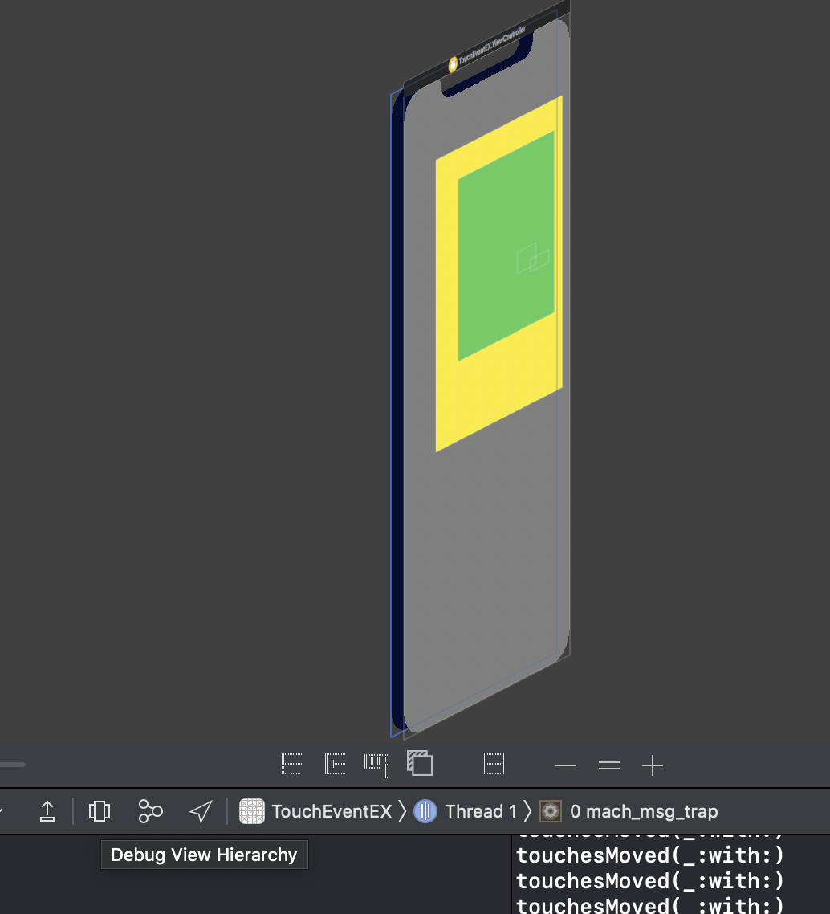

## application 실행시..

 내부적으로 아래와 같이 `UIApplication`을 생성한다.

아래 코드는 AppDelegate에 Attrubite로 **`@UIApplicationMain`** 으로 붙어있다.

- 이를 생략시 main을 못찾는다는 컴파일 에러메시지가 뜰 것이다.
- AppDelegate 테스트시에는 수동으로 아래 코드를 작성하기도 한다.

```swift
UIApplicationMain{
  	CommandLine.argc,
  	CommandLine.unsafeArgv,
  	NSStringFromClass(UIApplication.self),
  	NSStringFromClass(AppDelegate.self)
}
```


원래 순수한 UIView는 그리는 것만 관련한 처리를 하고, 기타 이벤트 처리 기능은 `UIResponder`를 상속받아서 수행한다.

- `UIResponder` 를 상속하는 객체들은 event handling이 가능하다.
- UIApplication도 UIResponder를 상속받는 대표적인 객체이며, UIApplication는 이벤트 처리를 위해 UIViewController, UIView 등으로 이벤트를 전달한다.
- 이벤트는 터치, 모션, 리모트컨트롤, 프레스 이벤트가 존재. 터치가 가장 많고 대표적이다.
- 

### [ 주의 ]

 **터치 이벤트와 뷰는 연결되어있다. 즉, 터치이벤트는 가상으로 다시 만들 수 없다.**

- 가상의 터치 인스턴스를 생성하는 것이 불가능하여, 실제 터치로 테스트해야 한다.


### 터치 이벤트 발생시...

**View 계층** 

- window부터 시작하여 view들은 계층적으로 쌓여있다.
- 대부분의 경우, subView는 superView위에 나타난다.


### 터치가 눌리면...

**(1)** hit-test view(터치가 눌린 view) 를 찾는다.

- UIView의 `hitTest` 메서드를 오버라이드해서 사용가능하다.

**(2)** `touchesBegan(_:with: )` 메서드가 호출된다.

- 첫번째 인자는 `Set<UITouch>`이다. 즉, 최대 6개(아이패드는 12개)까지 동시에 인식하는데, 터치의 순서가 중요하지는 않다.

**(3)** 이후에 터치한 위치가 옮겨지면 `touchesMoved(_:with: )` 메서드가 호출된다.

- 초당 60번의 터치를 인식 가능하다.
- 미세한 움직임도 감지한다.

**(4)** 터치가 떨어지면 `touchesEnded(_:with:)` 를 호출한다.


## HitTest

```swift
///Returns the farthest descendant of the receiver in the view hierarchy (including itself) that contains a specified point.
/// hitTest 검사를 통해서 터치를 인식할 UIView객체를 리턴한다.
override func hitTest(_ point: CGPoint, with event: UIEvent?) -> UIView? {
  	return self
}
```


### Touch Event Debug

- 시뮬레이터 앱 실행중에 `Debug view Hierarchy`  아이콘을 누르면 UIView의 3차원 계층구조를 파악할 수 있다.

  


### Single Touch 처리

- 터치가 취소되는 경우에 대한 처리도 필요
  - 전화받을 때 등 터치 무시가 필요


### UI Touch 디버깅

- Log Message(디버깅 메시지)에 %B 입력으로 UIResponder의 touch 함수의 출력여부를 커맨드라인에 표시하여 확인 가능하다.
- 혹은 Action > Debugger command 로 


- Option 체크시 breakpoint에서 시뮬레이터의 작동이 멈추지 않는다.


### hit-test view 주의

`alpha < 0.1` 인 view의 경우 투명한 것으로 간주하여 hit test view의 대상에서 제외(무시)한다.

버튼/view의 색상이 clear color 값이어도 alpha가 1이면 hittest에 걸린다.


### touch property ex

```swift
override func touchesBegan(_ touches: Set<UITouch>, with event: UIEvent?) {
  backgroundColor = UIColor.red

  for touch in touches {
    touch.altitudeAngle // apple pencil의 입력 각도
    touch.force         // 터치의 강도 (z-axis 256단계 이상으로 분류)
    touch.location(in: self)    // view를 넘겨야 계산을 해준다. 전달받은 view를 기준으로 상대좌표를 계산해서 반환해준다.
    touch.previousLocation(in: self)
    touch.tapCount      // 짧은 순간의 여러번 터치에 대해 카운트
    touch.type          // 직접터치, 혹은 리모컨을 통한 간접 터치(애플티비) 등
    touch.preciseLocation(in: self) /// 손가락 터치의 정교한 입력을 반환. 힘의 중점
  }
  super.touchesBegan(touches, with: event)
}
```


### UIGestureRecognizer with ViewController

```swift
import UIKit

class ViewController: UIViewController {

    override func viewDidLoad() {
        super.viewDidLoad()
        // Do any additional setup after loading the view.
    }
  
    override func touchesBegan(_ touches: Set<UITouch>, with event: UIEvent?) {
        /// 자주 쓰는 터치 이벤트 패턴을 정리한 클래스가 존재한다.
        /// UIGestureRecognizer
        /// 제스처레코그나이저 생성시에는 제스처 인식할 대상(타겟)과 이벤트 발생시 실행할 메서드를 전달해야 한다.
        let rec = UILongPressGestureRecognizer.init(target: self, action: #selector(ViewController.longPressed(rec:)))
        rec.minimumPressDuration = 1         //초 단위
        self.view.addGestureRecognizer(rec)
        super.touchesBegan(touches, with: event)
    }
    @objc func longPressed(rec: UILongPressGestureRecognizer ){
        /// 레코그나이저는 기본적으로 상태(began/moved/ended)를 다 갖고 있다.
        /// 대신 갖고와서 처리해준다.
        let state = rec.state
        if state == .ended{
            self.view.backgroundColor = UIColor.gray
        }else{
            self.view.backgroundColor = UIColor.white
        }
    }
}
```


