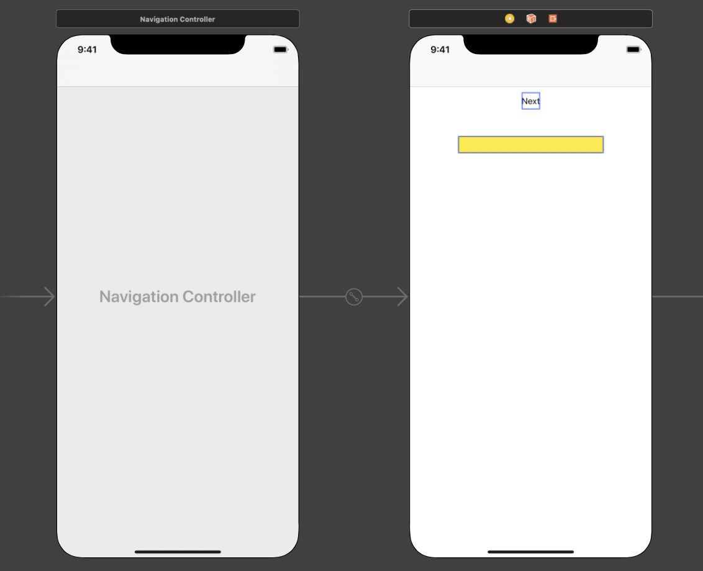
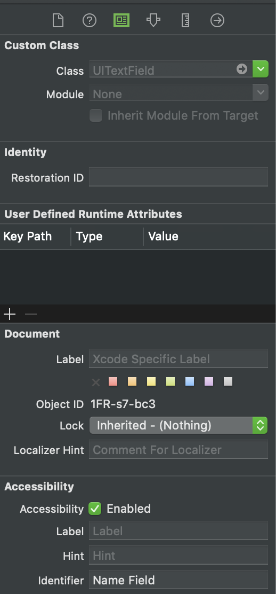
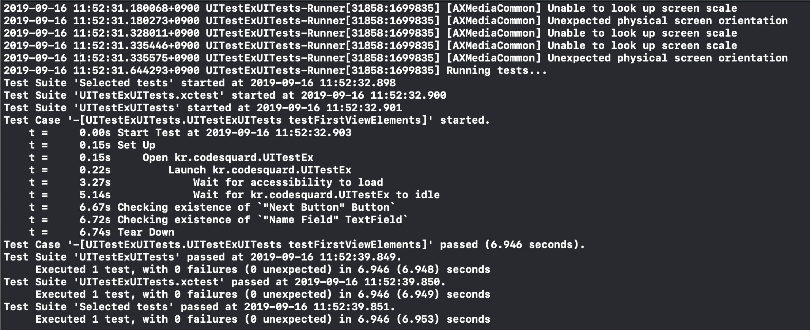
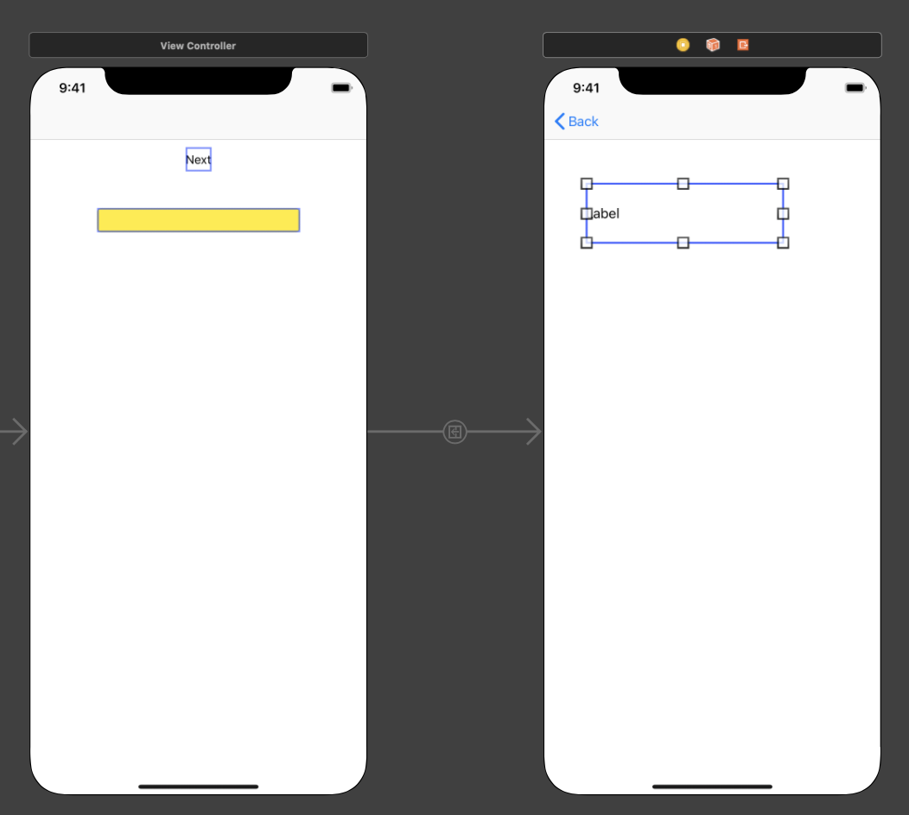
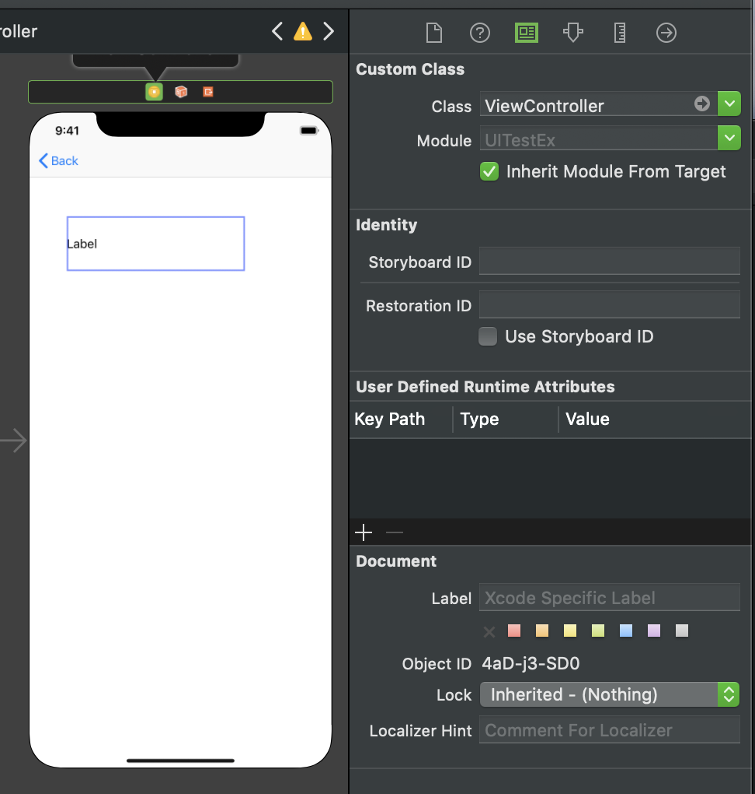
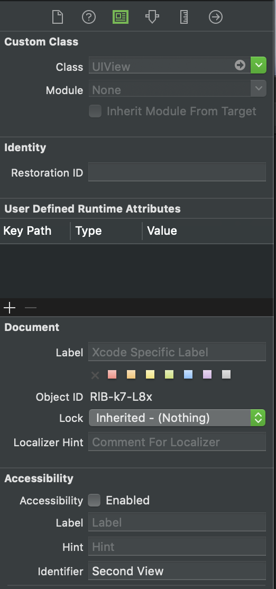
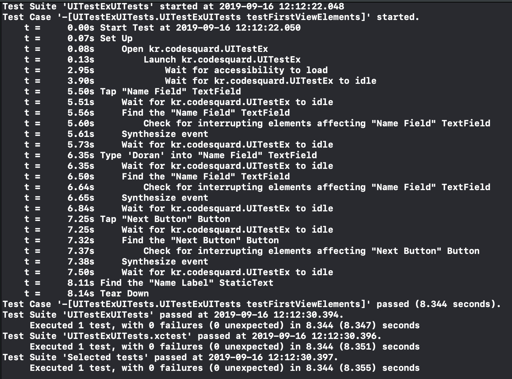

## UITest 

- UI 화면에서의 이벤트, 화면 이동 처리 등을 테스트할 수 있는 테스트 방식


### 실습 환경 

> Code Squard UI Test 강의 ( presented by Yagom) 내용을 바탕으로 작성되었습니다. 

##### 1) 빈 프로젝트를 생성하고 Target > iOS UI Testing Bundle 을 추가한다. 

 추가하면 Unit Test와 같이 UITest Group에 테스트코드용 파일이 생성된다.


##### 2) 아래와 같이 Navigation Controller에 연결된 `ViewController` 에 `Next Button`과 `textField` 를 생성합니다. 




##### 3) 뷰 컨트롤러에 생성한 Button/textField에 대해 `Identity Inspector`에서 다음과 같이 `Accessibility Identifier` 를 부여합니다. 




##### 4) 이제 테스트코드를 작성해봅니다. `XCUIApplication()` 인스턴스를 하나의 변수에 할당합니다.

```swift
class UITestExUITests: XCTestCase {
    let app = XCUIApplication()
    override func setUp() {
      // In UI tests it is usually best to stop immediately when a failure occurs.
        continueAfterFailure = false
      // UI tests 는 테스트하는 애플리케이션을 반드시 실행시키며, 이는 setup 메서드에서 실행됩니다. 
      // 앱을 실행하는 작업은 매 테스트 메소드가 일어날 때 발생합니다.  
      	app.launch()
    }
  	/// 테스트코드
  	func testFirstViewElements(){
   	 	let nextButton = app.buttons["Next Button"]
  	  XCTAssert(nextButton.exists)

   		let nameField = app.textFields["Name Field"]
    	XCTAssert(nameField.exists)
 		}
}
```


##### 5) 아래와 같이 테스트코드가 실행된 로그를 확인해 볼 수 있습니다.




##### 6) 이제 Next Button 으로 이동가능한 두번째 ViewController를 스토리보드에 추가합니다. 

- 뷰 컨트롤러는 종전의 것을 그대로 사용합니다. 다만, 테스트를 위한 `UILabel` 을 추가합니다.

   

  

- 또, 이전의 화면과 구분짓기 위해 Accessibility Identifier로 **Second View** 를 입력합니다.




##### 7) Next Button 을 탭 했을 때, 두번째 ViewController로 이동하는 것을 테스트해봅니다.

```swift
func testNextButton(){
  	app.buttons["Next Button"].tap()
  	XCTAssert(app.otherElements["Second View"].exists)
}
```


##### 8) 마찬가지로 두번째 화면에서 back 버튼으로 첫 화면으로 돌아가는 것을 테스트해봅니다.

```swift
func testMoveBack(){
  	app.navigationBars.buttons.firstMatch.tap()
    XCTAssert(app.textFields["Name Field"].exists)	///첫번째 뷰의 요소
}
```


##### 9) 이제 첫번째 뷰 컨트롤러에서 `textField` 에 값을 입력하여, 이 내용이 두번째 뷰 컨트롤러로 잘 연결되는지 테스트해봅니다.

- (1) 우선, 테스트 전에 앱의 데이터 전달을 위한 동작을 추가하기 위해 `ViewController.swift` 파일을 수정합니다.

  - IBOutlet 요소들은 스토리보드에서 연결하도록 합니다.

  ```swift
  import UIKit
  
  class ViewController: UIViewController {
      var name: String!
      @IBOutlet weak var nameField: UITextField!
      @IBOutlet weak var nameLabel: UILabel!
  
      override func viewDidLoad() {
          super.viewDidLoad()
          /// 코드레벨에서 Accessibility Id 부여 가능합니다.
          nameField?.accessibilityIdentifier = "Name Field"
          
          guard let name = name else {
              return
          }
          nameLabel.text = name
      }
  
      override func prepare(for segue: UIStoryboardSegue, sender: Any?) {
          guard let secondVC = segue.destination as? ViewController else {
              return
          }
          secondVC.name = nameField.text
      }
  }
  ```

- (2) 이제 테스트 코드를 작성합니다.

  ```swift
  func testPrepareSegue(){
  		app.textFields["Name Field"].tap()
    	app.textFields["Name Field"].typeText("Doran")
    	app.buttons["Next Button"].tap()
    	XCTAssert(app.staticTexts["Name Label"].label == "Doran")
  }
  ```

- 정상적으로 실행되었음을 알 수 있습니다.

  


### Other Frameworks

- KIF (iOS Integration Testing Framework)
  - objective-C 로 된 UI Test 라이브러리