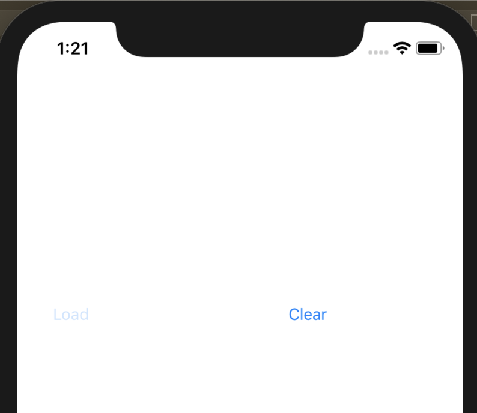
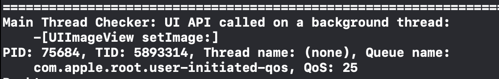
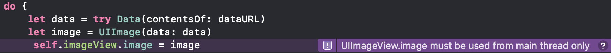
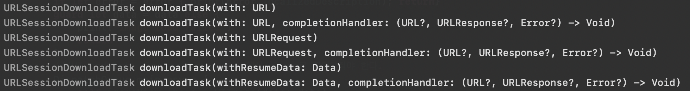
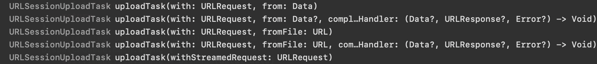

# iOS Network Programming


### 관련 항목

- JSONEncoder / JSONDecoder

- JSONSerialization

- Codable

- GCD / DispatchQueue


### 프로그래밍 예제

viewDidLoad() 혹은 button에서 이미지를 URL을 통해서 받아서 UIImageView로 화면에 출력하기

```swift
import UIKit

class ViewController: UIViewController {
    weak var imageView: UIImageView!
    
    override func viewDidLoad() {
        super.viewDidLoad()
        setUIImageView()
        setButtons()
    }
  
  	private func setUIImageView(){
        let frame = CGRect(x: 50, y: 50, width: 200, height: 200)
        let imageView = UIImageView.init(frame: frame)
        view.addSubview(imageView)
        self.imageView = imageView
    }
    
    private func setButtons(){
        let resetButton = UIButton(type: .system)
        resetButton.frame = CGRect.init(x: 250, y: 250, width: 40, height: 44)
        resetButton.setTitle("Clear", for: .normal)
        resetButton.addTarget(self, action: #selector(clearImage(_:))
            , for: .touchUpInside)
        let loadButton = UIButton(type: .system)
        loadButton.frame = CGRect.init(x: 30, y: 250, width: 40, height: 44)
        loadButton.setTitle("Load", for: .normal)
        loadButton.addTarget(self, action: #selector(loadImage(_:))
            , for: .touchUpInside)
        view.addSubview(loadButton)
        view.addSubview(resetButton)
    }
  
    private func receiveImageData(){
      	//..see below Ex4
    }
  	@objc func clearImage(_ sender: UIButton){
        self.imageView.image = nil
    }
    
    @objc func loadImage(_ sender: UIButton){
      	//..see below Ex1, Ex2, Ex3
    }
}
```

 

대략적인 코드 짜임새는 위와 같습니다. 이제 네트워크를 통해서 데이터를 받는 영역을 구현해봅시다. 맨 처음 해볼 것은 `셀렉터 메서드인 loadImage` 에서 이미지 데이터를 받아오는 것입니다. 크기가 큰 이미지 데이터를 로드 하는 방식으로 차이를 알아봅시다.


**Ex1) URL 주소를 활용하기 / 개선1 / 개선2**

**Ex2) URLRequest와 URLSession을 활용하여 이미지 요청하기** 

**Ex3) JSON Data를 요청하고 struct/class로 Decoder하기**


----


### Ex1)  URL주소를 활용하여 이미지 로드하기

```swift
@objc func loadImage(_ sender: UIButton){
  	guard let dataURL = URL(string: 
                        "https://upload.wikimedia.org/wikipedia/commons/3/3d/LARGE_elevation.jpg") else{ return }
  	do {
    		let data = try Data(contentsOf: dataURL)
    		let image = UIImage(data: data)
   		  self.imageView.image = image
    }catch{
      print(error.localizedDescription)
    }
}
```


### Ex1의 문제점

- 위와 같이 코드에서 메인 스레드 구분없이 네트워크 작업을 하는 경우, UI의 이벤트루프를 핸들링하는 **메인스레드에서 네트워크 통신을 담당** 하는 문제가 발생합니다. 

- 그래서 아래 그림 처럼, 응답을 받아 이미지뷰를 렌더링하기까지 **UI가 멈춰있는 현상이 발생**하게 됩니다.

  - **[그림1] 버튼 이벤트 시 네트워크 응답전까지 화면이 멈추는 현상**

  

### Ex1의 개선1과 문제점

```swift
@objc func loadImage(_ sender: UIButton){
		DispatchQueue.global(qos: .userInitiated).async { 	//code added
        guard let dataURL = URL(string: 
                         "https://upload.wikimedia.org/wikipedia/commons/3/3d/LARGE_elevation.jpg") else{ return }
        do {
            let data = try Data(contentsOf: dataURL)
            let image = UIImage(data: data)
            self.imageView.image = image
        }catch{
          print(error.localizedDescription)
        }
    }
}
```

- DispatchQueue를 사용하여 main스레드가 아닌 곳에서 network통신을 하도록 합시다. 이번 예제에서는 global GCD 큐에 비동기로 네트워크 통신을 하도록 하였습니다.
- qos는 총 다섯단계로 이번 주제에서 다룰 것은 아니므로 임의의 qos를 지정하였습니다.


#### 그런데, 

- 버튼 이벤트 실행시 아래와 같은 디버깅이 발생합니다. 
  - **[그림2] UI 렌더링 작업을 메인 스레드가 아닌 곳에서 하는 경우**





- code 상에서 아래와 같이 보라색 디버깅 메시지가 뜨는데요, **Apple이 권장하는 방식으로는 UI를 바꾸는 작업은 메인스레드에서 작업해야하는데**, global 큐 스레드에서 작업을 하도록 만들어서 위와 같은 경고메시지가 뜨는 것입니다. (정확히 말하면 fatal error류의 에러메시지는 아니어서 일단 실행은 됩니다.)


### Ex1의 개선2와 유의사항

```swift
@objc func loadImage(_ sender: UIButton){
		DispatchQueue.global(qos: .userInitiated).async { 
        guard let dataURL = URL(string: 
                         "https://upload.wikimedia.org/wikipedia/commons/3/3d/LARGE_elevation.jpg") else{ return }
        do {
            let data = try Data(contentsOf: dataURL)
            let image = UIImage(data: data)
          	DispatchQueue.main.async {					//code added
            		self.imageView.image = image
            }
        }catch{
          print(error.localizedDescription)
        }
    }
}
```

- 자 이제 문제를 해결하기 위해 imageView의 이미지 업데이트 처리는 main 스레드에서 작업하도록 변경합니다. UI 업데이트 코드부분에 `DispatchQueue.main.async` 을 추가하고, 클로저 내에 코드블럭을 집어넣으면 해결됩니다.
- 여기서 유의해야할 점은 `.sync`  가 아니라 `.async` 를 써야 한다는 점입니다.


## why? main.async

### SerialQueue / ConcurrentQueue와 sync/async는 별도 개념

- 우선 주의해야할 점은  main이 Concurrent가 아닌 **SerialQueue** 라는 형태와 **sync/async는 별도의 개념**입니다. 혼동해서는 안됩니다. 다만, **각각의 큐들이 어떤 방식으로 작업해야 할지는 알려줍니다**. 아래의 설명을 참고해봅시다.

  > **Synchronous** function returns the control on the current queue only after task is finished. It blocks the queue and waits until the task is finished. 
  >
  > 동기 함수는 task가 완료된 시점에 통제권을 현재의 큐에 반환합니다. 따라서 큐를 block시키고, task가 끝날때까지 기다립니다.

  > **Asynchronous** function returns control on the current queue right after task has been sent to be performed on the different queue. It doesn’t wait until the task is finished. It doesn’t block the queue.
  >
  > 비동기 함수는 수행될 task를 다른 큐에 전달한 시점에 **즉시 통제권을 현재의 큐에 반환**합니다. 해당 태스크가 끝날때까지 기다리지 않고, 큐를 block 시키지도 않습니다.
  >
  > [출처](https://medium.com/@broebling/dispatchqueue-main-the-main-queue-is-a-serial-queue-4607417fe535)

-  GCD 큐는 총 세가지 (메인 / 글로벌 / 커스텀) 이 있으며, 각각은 sync / async를 모두 지원합니다.

  - 한편, DispatchQueue.main은 기본적으로 serialQueue만 지원하고, DispatchQueue.global은 concurrentQueue만 지원, CustomDispatchQueue는 attributes 속성값에 따라 serial / concurrent를 설정할 수 있습니다.
  - `sync` 로 작동하는 경우, 스레드의 A가 해당 클로저 문구를 처리하고 난 다음에 serialQueue내의 다음 스레드가 UI작업을 수행합니다. 스레드A가 ui 작업을 하는 하위 child thread를 **`fork`** (작업 내용과 데이터를 복제하여 하위 스레드를 생성하여 명령의 수행을 위임하는 것이라고 이해하면 됩니다.) 떠서 작업을 위임하는 지는 잘 모르겠으나, 어쨌든 스레드A가 mainQueue의 리소스에 대한 통제권을 보유하고 있습니다.
  - `async `로 작동하는 경우, 메인 스레드 내에서 스레드A가 해당 클로저 문구를 처리할 child thread를 만들어서 작업을 수행시키고 **즉시 통제권을 DispatchQueue.main 으로 반환시킵니다.**  따라서 다른 ui 렌더링 작업을 위한 스레드 B의 동작이 가능해집니다.

  

### Main Thread의 역할

- 제드(zeddios)님의 블로그 글을 참고하였음을 밝힙니다. (출처 : 하단참고)

- 앱이 실행될 때 AppDelegate.swift 에서는 다음 메서드를 실행시킵니다.

  ```swift
  func application(_ application: UIApplication, didFinishLaunchingWithOptions launchOptions: [UIApplication.LaunchOptionsKey: Any]?) -> Bool
  ```

  이 메서드가 호출되면 앱의  run loop, main event loop 설정하고 event 처리를 시작하는데, `메인 이벤트 루프` 는 touch, gesture 등 **모든 UI Events 를 수신**합니다. 

- 앱의 UI Event는 **Responder chain**을 따라서 연결 되어있습니다. 이 chain을 따라 UIResponder로 이벤트를 전달합니다. 

  - 예:   **UIApplication -> UIWindow -> UIViewController -> UIView -> UIButton 등 ** 

- Responder chain에 연결된 모든 이벤트는 **메인 스레드에서 처리**합니다. 즉, **UIKit 내의 클래스들은 모두 메인스레드에서 처리되어야** 합니다.

- 또한, main thread는 **main dispatch queue**에 쌓인 `task`를 처리합니다. 

- `DispatchQueue.main` 은 **Serial Queue** 입니다. Serial Queue는 직렬 큐로 **하나의 task가 끝난 후에 다음 task를 순차적으로 실행**시킵니다. 

- Sync는 해당 task가 완료될 때 까지 task 처리하는 Thread에서 queue로 통제권을 반환하지 않습니다.

- 이 경우, **현재 task를 할당받은 스레드A 가 작업 통제권을 지니고 메인 큐를 block 처리한 상태**에서, 이미 이전의 다른 UI 작업이 리소스를 선점한 스레드B에 의해 진행되고 있었다면, 스레드A는 자원을 점유하지 못한 상태로 큐를 block 시키는 상황에 놓일 수 있게 됩니다. 즉, deadlock 상태에 놓이게 됩니다.

- 이는 **main thread**의 작업이 **thread-safe를 보장하고 있지 않기 때문에 발생 가능한 위험**입니다.

  - [참고 - objc.io](https://www.objc.io/issues/2-concurrency/thread-safe-class-design/) 
    - 특히 컬렉션뷰와 같이 여러 이미지들을 렌더링하는 경우, 위와 같은 deadlock이 발생하기 쉽습니다.
  - UIKit 내의 많은 클래스들은 thread-safe하지 않습니다.
    - [참고 - docs](https://developer.apple.com/library/archive/documentation/Cocoa/Conceptual/Multithreading/ThreadSafetySummary/ThreadSafetySummary.html)

### 결론

- 즉, 위에서 `main.sync` 를 쓰면 imageView.image = image 로 이미지 렌더링이 될 동안 다른 UI작업이 메인큐 내에서 **block당하여 지연상태에 놓이게 됩니다.**  
- 이러한 blocking은 때로는 이미 선점된 자원에 대한 동시 접근을 시도하면서 **deadlock 상태**에 놓이게 됩니다.
- 이것이 네트워크를 통해 전달받은 데이터를 렌더링 할 때 main 큐에서 sync를 쓰지 말아야 할 이유입니다.


### 참고

[deadlock 유발 코드](https://stackoverflow.com/questions/18297118/deadlock-with-dispatch-sync)

```swift
{
    dispatch_queue_t myQueue = dispatch_queue_create("com.mycompany.myqueue", 0);

    dispatch_sync(myQueue, ^{

        //Do EXTREME PROCESSING!!!
        for (int i = 0; i< 100; i++) {
            [NSThread sleepForTimeInterval:.05];
            NSLog(@"%i", i);
        }

        dispatch_sync(dispatch_get_main_queue(), ^{
            [self updateLabelWhenBackgroundDone];
        });
    });
}
```

- custom(global) queue 의 동기화 작업 사이에 main 큐에 대한 동기화 작업을 걸어주어도 main 에서의 데드락을 유발할 수 있다.


-----

----


## Ex2) URLRequest와 URLSession을 활용하여 이미지 요청하기

- URL 을 다음과 같이 URLRequest와 URLSession을 통해 데이터를 요청할 수도 있습니다.

  ```swift
  @objc func loadImage(_ sender: UIButton){
  		guard let dataURL = URL(string: 
                              "https://upload.wikimedia.org/wikipedia/commons/3/3d/LARGE_elevation.jpg") else{ return }
          let request = URLRequest(url: dataURL) 
          ///URLSession을 통한 request 요청은 기본적으로 background 스레드에서 동작한다.
          let session = URLSession.shared.dataTask(with: request){ (data, response, error) in
            	//...
          }
    			session.resume()
  }
  
  ```

  - URL구조체 에 문자열을 입력하여 URL 구조체를 생성하는 것은 기존과 동일합니다.

    - 실패가능한 이니셜라이저이므로 `guard let` 으로 unwrapping 해줍니다.

  - `URLRequest` 은 URL 구조체를 전달받아서  **요청 URL을 생성**합니다. **기본 설정은 Http 통신이며, HTTP Method는 "GET"** 이지만, 아래와 같이 다양한 형태로 설정이 가능합니다.

    ```swift
    /// HTTP Header 필드에 대해 [ keyString : headerField ] 설정 가능
    request.addValue(<#T##value: String##String#>, forHTTPHeaderField: <#T##String#>)
    /// 캐시정책 설정
    request.cachePolicy = URLRequest.CachePolicy.reloadIgnoringCacheData
    /// HTTP Method 타입을 설정가능
    request.httpMethod = "POST"			
    /// POST의 RequestBody로 binary 타입 Data를 할당가능
    request.httpBody = JSONSerialization.data(withJSONObject: Any, options: JSONSerialization.WritingOptions) 
    ```


### URLSession.shared.dataTask

- URLSession 은 NSObject 를 상속받는 클래스 입니다. 싱글턴 인스턴스로 read only 프로퍼티인 shared 를 통해 request 메서드 ( ` dataTask`)를 호출할 수 있습니다.

- `dataTask` 는 데이터 수신을 위해 **취소가능한 비동기 인터페이스 형태**로 제공됩니다. 즉, **기본 동작 방식이**  **`비동기`**  입니다.

- `dataTask`의 파라미터로 **URL** 혹은 **URLRequest** 를 받을 수 있습니다. 또한 **completionHandler** 를 통해 네트워크의 응답에 대한 처리를 할 수 있습니다. 

- 리턴값으로 **새로운 세션 dataTask** **`(URLSessionDataTask)`** 를 전달합니다. 

  - **URLSessionDataTask** 는 앱의 메모리에 다운로드된 데이터를 즉시 리턴하는 URL 세션 task 를 의미합니다.
  - 새로운 세션 dataTask를 생성하고 나서는 **반드시 `resume()` 메서드를 호출**해야 요청이 전달됩니다.
  - 리턴값으로 새로운 세션 dataTask를 받는 경우는 해당 변수에서, 그렇지 않은 경우에는 클로저 다음에 .resume() 을 호출하는게 권장사항입니다.

- delegate가 [`urlSession(_:dataTask:didReceive:)`](https://developer.apple.com/documentation/foundation/urlsessiondatadelegate/1411528-urlsession)  메서드를 포함한 세션에서 태스크를 생성할 때는 completion handler를 반드시 `nil` 로 처리해야 합니다.

- dataTask 외에도 백그라운드에서 처리되는 세션 요청 메서드로 `URLSession.shared.uploadTask`, `URLSession.shared.downloadTask` 등이 있습니다.

  

  

### 주의!!

- 일반적으로 네트워크 요청은 그 요청의 수행에 상대적으로 시간이 오래소요되므로 백그라운드에서 실행되는 것이 기본입니다. qos: DispatchQoS.QoSClass.background
- 다만, 이로 인한 UI 업데이트의 경우, 앞서 거론한 것처럼  GCD main에  async로 작업을 추가하는 것이 바람직합니다.


### CompletionHandler (after request loaded)

- **completionHandler는** <u>요청이 끝나고 난 뒤에 불리는 핸들러</u>로, **세개의 파라미터를 받습니다.**

  ```swift
  open func dataTask(with request: URLRequest, completionHandler: @escaping (Data?, URLResponse?, Error?) -> Void) -> URLSessionDataTask
  open func dataTask(with url: URL, completionHandler: @escaping (Data?, URLResponse?, Error?) -> Void) -> URLSessionDataTask
  ```

  - 각각 `Data`, `URLResponse`, `Error` 의 **옵셔널 형태**입니다. 

  - 1) **Data?**  

    -  요청에 대한 응답으로 Server에서 전달하는 Data가 있는경우 & 통신에 대한 응답이 성공적인 경우, 서버로부터 전달되는 **binary 데이터** 입니다.

  - 2) **URLResponse?** 

    -  요청에 대한 응답 메타데이터를 제공하는 객체로 HTTP header들이나 상태코드와 같은 제공합니다.
    - 만약 요청이 HTTP/S 로 이루어졌다면 URLResponse를 상속받는 **`HTTPURLResponse`** 가 리턴값으로 제공됩니다.

  - 3) Error?

    - 요청이 실패한 경우에는 `error 객체 `가 전달됩니다. 만약 요청이 성공한 경우에는 `nil` 입니다.

    

  - cf.  **`HTTPURLResponse`**  는 헤더필드 딕셔너리와  **`statusCode`** 를 가집니다.

    ```swift
    open var statusCode: Int { get }
    open var allHeaderFields: [AnyHashable : Any] { get }
    ```

  - **completionHandler** 는 `@escaping` 선언되어있으므로 <u>클로저를 외부에서 선언할 수</u> 있습니다. 

    - ( 위 예제코드도 이렇게 작성하였습니다.)
    - 핸들러 자체는 리턴값이 없습니다.

    

##### 핸들러 내부 코드 처리

- 핸들러를 처리함에 있어서 앱의 갑작스러운 Crash down 을 방지하기 위해서 데이터의 확인 순서는 다음과 같이 **파라미터의 역방향으로 진행하는 것을 추천**합니다.

  - 1) error 존재여부 체크

  - 2) response 에 대해 상태코드 체크 (HTTPURLResponse인 경우에 해당합니다.)

    - 정상적인 응답이라면 상태코드가 2xx 이므로 아래 예시처럼 처리할 수 있습니다.

      ```swift
      guard let httpResponse = response as? HTTPURLResponse,	///	다운 캐스팅 작업
      		(200...299).contains(httpResponse.statusCode) else {
          self.handleServerError(response)
          return
      }
      
      /// 응답의 mime 타입이 json인지 판별하는 예
      guard let mime = response.mimeType, mime == "application/json" else {
       	  print("Wrong MIME type!")
          return
      }
      ```

  - 3) Data unwrapping

    - 데이터에 대한 unwrapping 후에 해당 데이터의 형태가 binary Data 클래스이므로, 이를 적절한 방식으로 decode 하는 작업을 거칩니다.

    

  - 4) UI update 

    - DispatchQueue.main.async 에 작업을 추가하여 변환된 Data를 바탕으로 UI Update 를 수행합니다.
    - OperationQueue.main.addOperation 로도 메인 큐(메인스레드가 작업을 전담)에 작업을 추가할 수 있습니다. 기본적으로 비동기로 동작합니다.


- 전체 코드

  ```swift
  @objc func loadImage(_ sender: UIButton){
  		guard let dataURL = URL(string: 
                              "https://upload.wikimedia.org/wikipedia/commons/3/3d/LARGE_elevation.jpg") else{ return }
          let request = URLRequest(url: dataURL) 
          ///URLSession을 통한 request 요청은 기본적으로 background 스레드에서 동작
          let session = URLSession.shared.dataTask(with: request){ (data, response, error) in
              if let error = error { print(error.localizedDescription); return}
              guard let data = data else {
                  print("image load failed")
                  return
              }
              ///UI update는 DispatchQueue.main에서 async로 작업해줘야 한다.
              DispatchQueue.main.async {
                  self.imageView.image = UIImage(data: data)
              }
              ///DQ 말고 OperationQueue도 가능
              OperationQueue.main.addOperation {  ///addOperation은 기본적으로 비동기로 동작
                  self.imageView.image = UIImage(data: data)
              }
          }
    			session.resume()
  }
  
  ```


-----

----


## Ex3) JSON Data를 요청하고 struct/class로 Decoder하기

- 마지막으로 URLRequest의 결과로 전달되는 JSON Data를 struct나 class로 디코딩하는 실습을 해봅니다.

- 예제를 위해 HTTTP Method "GET"을 위한 샘플 사이트를 참고합니다. 아래 예시 외에도 다양한 사이트에서 요청을 주고받을 수 있습니다. 요청 포맷은 크롬의 JSON View extension 나 post man 프로그램을 통해서 응답객체로 전달되는 json 양식을 파악할 수 있습니다.

  - https://randomuser.me

- 위 사이트에서 다음과 같이 데이터를 요청하게 되는 경우, 데이터 샘플은 아래와 같습니다.

  - 요청 url : https://randomuser.me/api/?inc=gender,name,nat&results=5

  ```json
  {
      results: [
          {
            gender: "male",
            name: {
                    title: "mr",
                    first: "janusz",
                    last: "riese"
                    },
            nat: "DE"
          },
          {
            gender: "female",
            name: {
                    title: "miss",
                    first: "joanne",
                    last: "kuhn"
            },
            nat: "AU"
          },
        {
            gender: "male",
            name: {
                    title: "mr",
                    first: "سام",
                    last: "صدر"
            },
            nat: "IR"
        },
        {
            gender: "male",
            name: {
                    title: "mr",
                    first: "jeen",
                    last: "hoekman"
            },
            nat: "NL"
        },
        {
            gender: "male",
            name: {
                    title: "mr",
                    first: "nils",
                    last: "leroy"
            },
            nat: "FR"
        }
      ],
      info: {
        seed: "c3a88dc4abc72068",
        results: 5,
        page: 1,
        version: "1.2"
      }
  }
  ```

-  아래의 info 정보는 제외하고, 나머지 정보를 바탕으로 객체에 디코딩을 작업하려고 합니다.

- naive 한 방식으로 딕셔너리에 [AnyHashable: Any ] 형태로 디코딩 하는 방식도 존재합니다만 여기서는 Swift의 Codable 프로토콜을 사용하여 구현하도록 하겠습니다.

- 가장 작은 사이즈의 { key: value } 형태의 jsonObject 부터 다루기로 합니다. 우선 `name` 을 키로하는 데이터에 대해

  ```swift
  import Foundation
  
  struct Name: Codable {
      let title: String
      let first: String
      let last: String
  }
  ```

  - Codable 기본 활용형태에서 알 수 있듯, 기본 데이터 타입 구조체는 별도의 decoder 이니셜라이저 없이 프로토콜 채택만 해주면 자동으로 구현가능합니다. 다만 변수명은 json의 키값과 맞춰줘야 합니다. 
  - 서로 다른 경우에는 CodingKey   프로토콜을 활용하는 방식으로 접근하면 됩니다.

-  다음으로는 이 name 을 포함하는 구조체를 작성합니다.

   ```swift
  struct PersonInfo: Codable{
      enum Gender: String, Codable{
          case male, female
      }
      var gender: String
      var nat: String
      var name: Name
  }
   ```

  - 해당 구조체에 대해 별도의 키값이 존재하지 않으므로 임의의 이름을 지어줍니다. 역시 Codable 프로토콜을 채택합니다.
  - gender의 값으로 "male", "female"의 형태로 데이터가 들어오므로, Codable 사용시, 이를 enum 데이터타입으로 변환시킬 수도 있습니다.

- 다음으로는 전체 응답객체를 만듭니다. 역시 임의의 구조체 명으로 작성합니다.

  ```swift
  struct RandomUserResponse: Codable{
      let results: [PersonInfo]
      // let info: Info
  }
  ```

 

요청 json을 구조체/클래스 형태로 디코딩 하는 코드예시 입니다.

``` swift
guard let requestUrl = URL(string: "https://randomuser.me/api/?inc=gender,name,nat&results=5") else {
            return
        }
        ///Ex3 - Json Request
let task = URLSession.shared.dataTask(with: requestUrl){ (data, response, error) in
    guard let data = data else{
      	print("load data failed") /// 원래는 에러 핸들러로 처리해주는게 바람직합니다.
      	return
     }
		let decoder: JSONDecoder = JSONDecoder()
    do{
				let userResponse = try decoder.decode(RandomUserResponse.self, from: data)
				let users = userResponse.results
				print("\(users.count) 명의 user 로드됨")		//5
    }catch{
				print(error.localizedDescription)
		}
}
task.resume()
```


- 앞서 살펴본 네트워크 내용은 간략히 생략하고 봅시다. 먼저 JSONDecoder 인스턴스를 생성합니다. 

- 해당 인스턴스를 통해서 Has-a 관계상의 최상위 계층의 클래스 타입에 대해 decode 메서드를 실행시킵니다.
- 바이너리 데이터에 대한 디코딩 결과로 userResponse 변수에 RandomUserResponse 객체가 초기화되고, json 데이터가 자동으로 파싱됩니다.

- 만약 서브클래스가 존재하는 경우에는 서브클래스에서 추가된 프로퍼티에 대해 CodingKey를 설정해줘야합니다.

- info 데이터는 값이 존재하지 않으므로 별도로 파싱하지는 않습니다. (그렇다고 에러가 나지는 않습니다.)
- 만약 json 데이터로 전달받는 값이 존재할지 안할지 불명확하다면 옵셔널 처리를 해주면 파싱에러를 해결할 수 있습니다.
  - 다만, 값이 없음에도 서버상에서 null에 해당하는 데이터를 전달하는 경우에는 이에 알맞게 백엔드 영역과 조율을 하든가, `nil` 로 데이터를 처리해줘야 합니다.


### 출처

https://developer.apple.com/documentation/foundation/urlsession/1410330-datatask

https://learnappmaking.com/urlsession-swift-networking-how-to/


Codesquard Yagom's Lecture 

https://stackoverflow.com/questions/46732016/main-async-vs-main-sync-vs-global-async-in-swift3-gcd

https://magi82.github.io/gcd-01/

https://zeddios.tistory.com/519