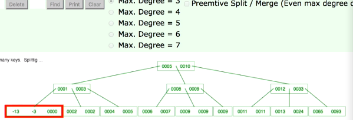
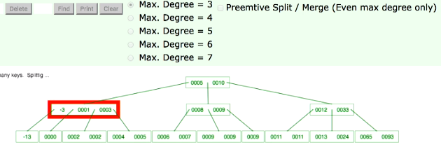
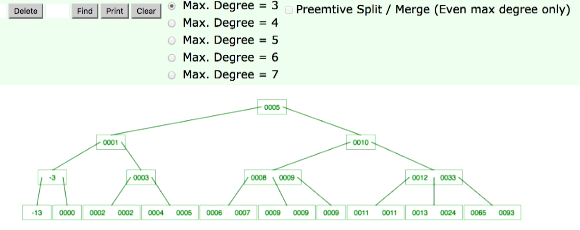
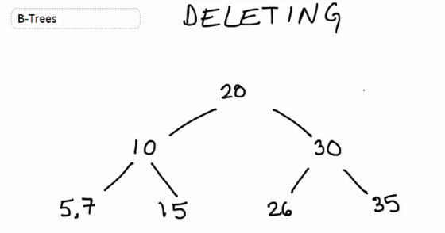
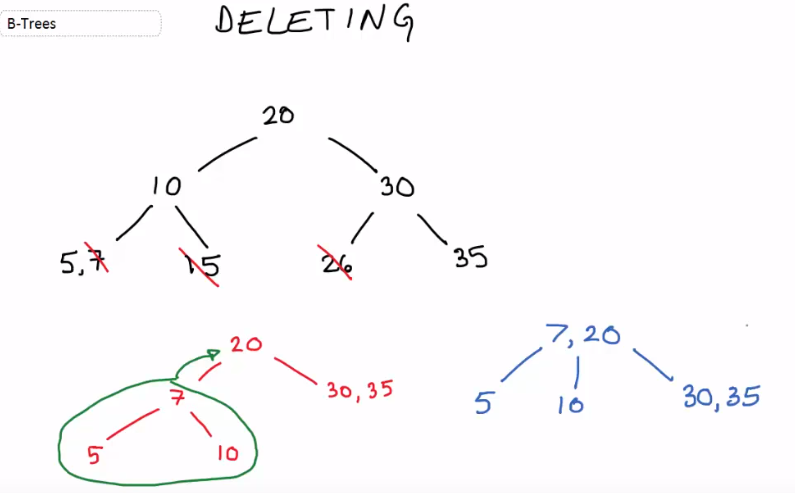
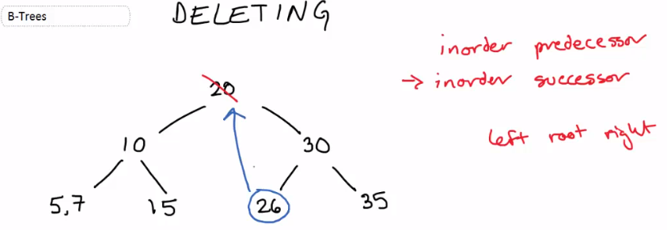
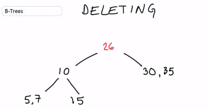

# DB

## 0) 정규화 3단계

https://untitledtblog.tistory.com/128?category=714634

- 관계형 데이터베이스의 설계 단계에서 데이터의 중복을 최소화하기 위해 데이터의 구조를 결정하는 작업

#### 1NF 원자값이 아닌 속성을 분해한다. 반복되는 값을 제거한다.

- R에 속한 **모든 도메인이 원자값(atomic value)만으로 되어있는 경우로** 만든다.

  - <u>한 컬럼에 여러 값을 지녀서는 안된다.</u>

    

- 모든 엔티티 타입의 속성에는 하나의 속성값만을 가지고 있어야 한다.

- 반복되는 속성의 집단은 별도의 엔티티 타입으로 분리 함

- 중복된 레코드 제거

- PK (or 후보키) 컬럼을 만들기 위해 릴레이션 분리 

- 1NF 만족못하는 [그림2] 테이블에서는 [ INSERT, DELETE, UPDATE ] 에서 anomaly 발생 가능

  - **1) INSERT anomaly**

    만약, [그림 2]의 테이블에 S5이라는 공급자가 London에 있다는 정보를 저장하고 싶다면, primary key의 구성 요소인 P#에 해당하는 필드에 dirty data를 입력해야 한다.

  - **2) DELETE anomaly**

    테이블에서 S3이라는 공급자가 더는 P2를 공급하지 않게 되어, S#이 S3에 해당하는 레코드를 삭제하면, S3이라는 공급자가 Busan에 있다는 정보까지 손실된다.

  - **3) UPDATE anomaly**

    테이블에서 S1이라는 공급자가 있는 도시를 Seoul에서 Paris로 변경하려면 총 3번의 update 연산이 필요하다. 즉, 하나의 정보를 변경하기 위해 불필요한 update 연산이 2번 더 실행되어야 한다.

- 1차 정규화 후 

#### 2NF : 부분 함수 종속성 제거

> **부분함수종속성** : **X->Y**에서 **Y가 X의 부분집합에 대해서도 함수적으로 종속**됨
>
> 즉, 기본키중에 특정 컬럼에만 종속된 컬럼**(부분적 종속)이 없어야 한다**

- 테이블에 존재하는 <u>모든 함수 종속 관계가</u> **완전 함수 종속이어야** 한다.

- 가령 위의 1차정규화 테이블에서 기본키가 (Student, Subject)인데 `Age` 는 Student에만 종속되어있다. 

- 따라서 Student를 기준으로 테이블을 분리한다.

  **학생 테이블**

  

  **과목 테이블**

  

  - 두 테이블 모두 2차 정규형을 만족하게 된다. 위 테이블은 삽입/갱신/삭제 이상을 겪지는 않으나, 다른 2NF 테이블에서는 가능하다.

-  위 테이블에서 primary key는 {S#, P#}이지만, CITY라는 필드는 {S#, P#}이 아니라 S#에 대해 함수 종속적이다. 따라서, [그림 1]의 테이블에는 완전 함수 종속이 아닌 함수 종속 관계가 존재하므로 2NF가 아니다

- 위의 [그림 1]의 테이블을 2NF의 정의를 만족하도록 변형하면, 아래의 그림과 같이 SSC와 SPQ로 표현되는 두 개의 테이블로 분해할 수 있다.'

  

- 1NF 만족하는 이 두 테이블도 다른 anomaly가 발생 가능

#### 3NF 이행 함수 종속성 제거

> **이행적 함수 종속성 : 릴레이션 R에서 속성 A->X이고, X->Y이면 A->Y임**
>
> 즉, **기본키 외의 속성간의 종속성(이행적 함수 종속성)이 존재하지 않게 해주는 작업**

- Student_id가 기본키이고, 기본키가 하나이므로 2차 정규형은 만족하는 것으로 볼 수 있습니다

- But, Zip컬럼을 알면 Street, City, State를 결정할 수 있습니다

- 2차정규화와 마찬가지로 테이블을 분리함으로써 해결할 수 있는데, 이렇게 두 개의 테이블로 나눔으로써 3차 정규형을 만족

#### BCNF 결정자가 후보키가 아닌 함수종속을 제거 

>  X->Y에서 X가 후보키가 아닌 경우를 제거 

BCNF는 (Boyce and Codd Normal Form) 3차 정규형을 조금 더 강화한 버전으로 볼 수 있습니다. 이는 3차 정규형으로 해결할 수 없는 이상현상을 해결할 수 있습니다. BCNF란 3차정규형을 만족하면서 **모든 결정자가 후보키 집합에 속한 정규형**입니다. 아래와 같은 경우를 생각해보면, 후보키는 수퍼키중에서 최소성을 만족하는 건데, 이 경우 (학생, 과목) 입니다. (학생, 과목)은 그 로우를 유일하게 구분할 수 있습니다. 근데 이 테이블의 경우 교수가 **결정자** 입니다. (교수가 한 과목만 강의할 수 있다고 가정) 즉, 교수가 정해지면 과목이 결정됩니다. 근데 교수는 후보키가 아닙니다. 따라서 이 경우에 BCNF를 만족하지 못한다고 합니다. 3차 정규형을 만족하면서 BCNF는 만족하지 않는 경우는 언제일까요? 바로 **일반 컬럼이 후보키를 결정**하는 경우입니다.

| **학생** | **과목** | **교수** | **학점** |
| -------- | -------- | -------- | -------- |
| 1        | AB123    | 김인영   | A        |
| 2        | CS123    | Mr.Sim   | A        |
| 3        | CS123    | Mr.Sim   | A        |

위와 같이 테이블이 구성된 경우에 데이터가 중복되고, 갱신 이상이 발생합니다. 예를 들어 Mr.Sim이 강의하는 과목명이 바뀌었다면 두 개의 로우를 갱신해야합니다. 이를 해결하기 위해서는 마찬가지로 테이블을 분리합니다.

**교수 테이블**

| **교수** | **과목** |
| -------- | -------- |
| 김인영   | AB123    |
| Mr.Sim   | CS123    |

**수강 테이블**

| **학생** | **과목** | **학점** |
| -------- | -------- | -------- |
| 1        | AB123    | A        |
| 2        | CS123    | A        |
| 3        | CS123    | A        |

https://untitledtblog.tistory.com/128?category=714634

------

---

## 1) Lock 기본

- 다중 트랜잭션 환경에서 데이터베이스의 일관성과 무결성을 유지하려면 트랜잭션의 순차적 진행을 보장할 수 있는 직렬화(serialization) 장치가 필요함
- 직렬화가 가능하도록 하기 위해 모든 DBMS가 공통적으로 사용하는 메커니즘이 Lock

### 공유 Lock과 배타적 Lock

#### 1) 공유 Lock

- 공유(Shared) Lock은 데이터를 읽고자 할 때 사용
- 다른 공유 Lock과는 호환되지만 배타적 Lock과는 호환되지 않는다.
- `호환된다 ` ==  한 리소스에 **두 개 이상의 Lock을 동시에 설정할 수 있음**을 뜻한다.
  - 공유 Lock을 설정한 리소스에 다른 트랜잭션이 추가로 공유 Lock을 설정 (배타적 Lock은 불가능)
- 다른 사용자가 읽고 있는 리소스를 동시에 읽을 수는 있어도 변경 중인 리소스를 동시에 읽을 수는 없다

#### 2) 배타적 Lock

- 배타적(Exclusive) Lock은 데이터를 변경하고자 할 때 사용되며, 트랜잭션이 완료될 때까지 유지
- 그 Lock이 해제될 때까지 다른 트랜잭션은 해당 리소스에 접근할 수 없다.
- 다른 트랜잭션에 의해 Lock이 설정된 리소스는, 그것이 공유 Lock이든 배타적 Lock이든, 배타적 Lock을 동시에 설정할 수 없다.

#### 블로킹(Blocking)

- Lock 경합이 발생해 특정 세션이 작업을 진행하지 못하고 멈춰 선 상태
- 공유 Lock끼리는 호환되기 때문에 블로킹이 발생하지 않는다.
- **공유 Lock과 배타적 Lock은 호환되지 않아 블로킹이 발생**할 수 있다. 
- 배타적 Lock끼리는 당연히 호환되지 않는다.

- <u>블로킹 상태를 해소하는 방법</u>은 **커밋(또는 롤백)**뿐

####  Lock에 의한 성능 저하를 최소화하는 방안

① 우선, 트랜잭션의 원자성을 훼손하지 않는 선에서 트랜잭션을 가능한 짧게 정의

② 같은 데이터를 갱신하는 트랜잭션이 동시에 수행되지 않도록 설계

③ 주간에 대용량 갱신 작업이 불가피하다면, 블로킹 현상에 의해 사용자가 무한정 기다리지 않도록 적절한 프로그래밍 기법을 도입 ex) 세션 레벨에서 LOCK_TIMEOUT을 설정

④ 트랜잭션 격리성 수준(2절 2항 참조)을 불필요하게 상향 조정하지 않는다.

## 2) 2 phase lock

http://www.jidum.com/jidums/view.do?jidumId=284

- 직렬성 보장을 통해 동시성을 제어하는 2단계 로킹 기법

모든 트랜잭션들이 lock과 unlock연산을 확장단계와 수축단계로 구분하여 수행함 

| 확장단계     | 트랜잭션은 lock 만 수행할 수 있고 unlock은 수행할 수 없는 단계 |
| ------------ | ------------------------------------------------------------ |
| **수축단계** | **트랜잭션은 unlock 만 수행할 수 있고 lock은 수행할 수 없는 단계** |

#### 2단계 로킹 규약 이론(Two-Phase locking protocol theorem)

1. 모든 로킹 연산(read_lock, write_lock) 들이 최초의 unlock 연산 보다 앞에 나오는 경우, 그 트랜잭션은 2단계 로킹 프로토콜을 준수
2. 만일 모든 트랜잭션들이 2단계 로킹 규약을 준수한다면, 모든 트랜잭션들은 직렬성을 보장받게 됨
3. 그 역은 성립하지 않음.
4. 직렬가능성을 보장할 수 있는 규약으로 가장 많이 사용

2PL 개념도

- https://mangkyu.tistory.com/30
- 2단계 로킹 규약(2PLP: Two-Phase Locking Protocol)은 트랜잭션들이 lock하는 시간과 unlock을 하는 시간을 구분하여 수행하도록 하는 것

- 일관성이 위배되는 문제가 발생

#### Basic 2단계 로킹 기법의 문제점

1. 2단계 로킹 기법이 deadlocks의 완전한 제거를 나타내지는 못함
2. 2단계 로킹 기법 상태에서 Cascading rollback이 가능

#### Strict 2 Phase Locking Protocol

- 2단계 로킹

- 모든 독점 lock(Lock-X)는 그 **Transaction이 완료될 때까지 unlock 하지 않음**. 그대로 유지

- **Commits/Aborts가 수행될 때까지 모든 exclusive locks을 잡고 있어야** 함

- 연쇄복귀(Cascading rollback) 문제 발생하지 않음
  - 교착상태(deadlock)는 해결하지 못함
- 대부분의 DBMS 사용

## **[ 데드락(Deadlock) ]**

- 데드락(Deadlock): 두 개 이상의 트랜잭션이 각각 자신의 데이터에 대하여 락을 획득하고 상대방 데이터에 대하여 락을 요청하면 무한 대기 상태에 빠질 수 있는 현상

-  일반적으로 데드락이 발생하면 DBMS가 T1 혹은 T2 중 하나를 강제로 중지시켜 한 트랜잭션은 정상적으로 실행되며 중지된 트랜잭션에서 변경한 데이터는 원래 상태로 롤백시킨다.

## ACID

트랜잭션이 보장해야 하는 4가지 특성

- 원자성 (Atomicity) : 한 트랜잭션 내에서 실행한 작업들은 하나의 작업으로 간주한다. 모두 성공 또는 모두 실패되어야 한다. 

- 일관성 (Consistency) : 모든 트랜잭션은 일관성 있는 데이타베이스 상태를 유지한다. 이를테면 DB에서 정한 무결성 조건을 항상 만족.

- 격리성 (Isolation) : **동시에 실행되는 트랜잭션들이 서로 영향을 미치지 않도록 격리** 해야한다.

- 지속성 (Durability) : 트랜잭션을 성공적으로 마치면 그 **결과가 항상 저장**되어야 한다.

>격리성을 완벽히 보장하기 위해 모든 트랜잭션을 순차적으로 실행한다면 동시성 처리 이슈가 발생한다. 반대로 동시성을 높이기 위해 여러 트랜잭션을 병렬처리하게 되면 데이터의 무결성이 깨질 수 있다.

- 출처: https://feco.tistory.com/45 [wmJun]

## 3) 동기화수준

https://feco.tistory.com/45

### 낮은 격리수준 관련 문제점들 

#### (1) Dirty Read

> 다른 트랜잭션에 의해 수정됐지만 아직 커밋되지 않은 데이터를 읽는 것
>
>  변경 후 아직 커밋되지 않은 값을 읽었는데 변경을 가한 트랜잭션이 최종적으로 롤백된다면 그 값을 읽은 트랜잭션은 비일관된 상태에 놓이게

- 한 트랜잭션(T1)이 데이타에 접근하여 값을 'A'에서 'B'로 변경했고 아직 커밋을 하지 않았을때, 다른 트랜잭션(T2)이 해당 데이타를 Read 하면?
  - T2가 읽은 데이타는 B가 될 것이다. 하지만 T1이 최종 커밋을 하지 않고 종료된다면, T2가 가진 데이타는 꼬이게 된다.

#### (2) Non-Repeatable Read

> 한 트랜잭션 내에서 같은 쿼리를 두 번 수행했는데, 그 사이에 다른 트랜잭션이 값을 수정 또는 삭제하는 바람에 두 쿼리 결과가 다르게 나타나는 현상

- 한 트랜잭션(T1)이 데이타를 **Read** 하고 있다. 이때 다른 트랜잭션(T2)가 데이타에 접근하여 값을 변경 또는, 데이타를 삭제하고 커밋을 때려버리면?

- 그 후 T1이 다시 해당 데이타를 Read하고자 하면 변경된 데이타 혹은 사라진 데이타를 찾게 된다.

#### (3) Phantom Read

> 한 트랜잭션 내에서 같은 쿼리를 두 번 수행했는데, 첫 번째 쿼리에서 없던 유령(Phantom) 레코드가 두 번째 쿼리에서 나타나는 현상

- 트랜잭션(T1) 중에 특정 조건으로 데이타를 검색하여 결과를 얻었다.
- 이때 다른 트랜잭션(T2)가 접근해 해당 조건의 데이타 일부를 삭제 또는 추가 했을때, 아직 끝나지 않은 T1이 다시 한번 해당 조건으로 데이타를 조회 하면 T2에서 추가/삭제된 데이타가 함께 조회/누락 된다. 그리고 T2가 롤백을 하면? 데이타가 꼬인다

https://feco.tistory.com/45

###  트랜잭션 격리수준

위와 같은 문제들 때문에, ANSI표준에서 트랜잭션의 격리성과 동시 처리 성능 사이의 Trade-off를 두고 4단계 격리수준을 나누었다. 내려갈수록 격리 수준이 높아져서 언급된 이슈는 적게 발생하지만 동시 처리 성능은 떨어진다.

참고로, 트랜잭션이 발생하면 락(Lock)이 걸리는데, SELECT 시에는 **공유 락**,  CREATE/INSERT/DELETE 시에는 **배타적 락**이 걸린다

#### (1) Read Uncommitted

##### 한 트랜잭션에서 <u>커밋하지 않은 데이터에 다른 트랜잭션이 접근</u>하여 <u>커밋하지 않은 데이터를</u> <u>읽을 수 있다</u>.

> 이 수준은 당연히 위에서 언급한 모든 문제에 대해 발생가능성이 존재한다. 대신, 동시 처리 성능은 가장 높다.

- **발생 문제점 : Dirty Read, Non-Repeatable Read, Phantom Read**

#### (2) Read Committed

##### 커밋이 완료된 데이타만 읽을 수 있다.

트랜잭션이 **<u>커밋되어 확정된 데이터만 다른 트랜잭션이 읽도록</u>** 허용

> Dirty Read가 발생할 여지는 없으나, Read Uncommitted 수준보다 동시 처리 성능은 떨어진다.  대신 Non-Repeatable Read 및 Phantom Read는 발생 가능하다.데이타베이스들은 보통 Read Committed를 디폴트 수준으로 지정한다.

- **Dirty Read**를 방지

- **발생 문제점 : Non-Repeatable Read, Phantom Read**

#### (3) Repeatable Read

##### 트랜잭션 내에서 한번 조회한 데이타를 반복해서 조회해도 같은 데이타가 조회 된다

트랜잭션 내에서 쿼리를 두 번 이상 수행할 때, 첫 번째 쿼리에 있던 레코드가 사라지거나 값이 바뀌는 현상을 방지

> 이는 개별 데이타 이슈인 Dirty Read나 Non-Repeatable Read는 발생하지 않지만, 
>
> 첫 번째 쿼리에서 없던 새로운 레코드가 나타날 수 있는 Phantom Read는 발생가능하다.

- **발생 문제점 : Phantom Read**

#### (4) Serializable

##### 가장 엄격한 격리 수준

> 첫 번째 쿼리에 있던 레코드가 사라지거나 값이 바뀌지 않음은 물론 새로운 레코드가 나타나지도 않는다.

**위 3가지 문제점을 모두 커버 가능**하다. 하지만 동시 처리 성능은 급격히 떨어질 수 있다.

---

---

## 4) 회복 프로토콜 

https://mangkyu.tistory.com/30

#### **[ 장애의 유형 ]**

- 트랜잭션 장애: 트랜잭션의 실행 시 논리적인 오류로 발생할 수 있는 에러 상황
  - 트랜잭션 내에 잘못된 데이터 입력, 데이터의 부재, 오버플로우(Overflow), 자원의 한계 초과 요청, 어떤 수를 0으로 나누게 되는 연산 등
- 시스템 장애: H/W 시스템 자체에서 발생할 수 있는 에러 상황
  - HW 오작동, 데드락
- 미디어 장애: 디스크 자체의 손상으로 발생할 수 있는 에러 상황

#### **[ 회복(Recovery) ]**

- 데이터베이스를 장애가 발생했던 이전의 상태로 복구시켜서 일관된 데이터베이스 상태를 만드는 것

##### 회복을 위한 데이터 복사본을 만드는 방법

- 1) 덤프(Dump)를 이용하는 방법
  - 일정 주기로 원본의 데이터베이스의 모든 내용을 다른 저장장치에 복사
- 2) 로그(Log)를 이용하는 방법
  - 변경 이전의 데이터베이스를 기준으로 변경 연산이 발생할 때 마다 로그 파일을 작성하여 기록
  - 회복할 때 로그에 적힌 내용을 사용하여 복원하는 방법

#### 로그(Log)

- 트랜잭션이 데이터의 변경사항을 데이터베이스에 직접 기록하기 전에 미리 기록해두는 별도의 데이터베이스
- 장애 발생 시 복원을 위해서 사용
- 로그의 구조: <트랜잭션 번호, 로그의 타입, 데이터 항목 이름, 수정 전 값, 수정 후 값>
- 로그의 타입: START, INSERT, UPDATE, DELETE, ABORT, COMMIT 등 트랜잭션의 연산 타입

#### **[ 로그 파일을 이용한 회복 ]**

- 데이터의 변경이 발생할 때 마다 생성되는 로그 파일을 이용하는 것
- 데이터의 변경 기록을 저장해 둔 로그 파일을 이용하면 시스템 장애도 복구 가능

#### REDO

- 트랜잭션이 종료되었는지 혹은 중단되었는지 여부를 판단하여 종료된 경우에는 종료를 확정하기 위하여 재실행 하는 것
- 로그 파일에 **트랜잭션의 시작(START)**이 있고 **종료(COMMIT)이 있는 경우** 로그를 보면서 **트랜잭션이 변경한 내용을 다시 기록하는 과정**
- 

#### UNDO

- 트랜잭션이 중간에  중단된 경우에는 없던 일로 되돌리기 위해 UNDO(취소)를 진행
- 장애가 발생한 후 시스템을 재가동했을때, 로그 파일에 트랜잭션의 **시작(START)만 있고 종료(COMMIT)이 없는 경우** 완료하지 못했지만 버퍼의 변경 내용이 데이터베이스에 기록되어 있을 가능성이 있기 때문에 **로그를 보면서 트랜잭션이 변경한 내용을 원상복구시키는 과정**
- 

- 트랜잭션이 시작하면 변경연산에 대해서 계속 로그 파일에만 기록을 하고 실제 데이터베이스에는 반영을 하지 않습니다. 그러다가 부분 완료까지 성공을 하면 로그 파일을 참조하여 실제 데이터베이스의 값을 변경시킵니다.
- 트랜잭션이 실패한 경우에는 연산이 로그파일에만 저장이 되어있고 데이터베이스에는 반영되어있지 않으므로 추가 작업이 필요 없지만 중간에 부분 완료를 거친 후에 트랜잭션 실패가 발생한다면, 데이터베이스에 일부 기록된 내용이 있을 수 있으므로 이러한 경우에는 UNDO를 해주어야 합니다. 

#### 트랜잭션 성공한 경우 예

#### 트랜잭션 실패한 경우 예

#### **[ 로그 파일의 회복 방법 ]**

- #### 즉시 갱신(Immediate Update)

  - **갱신된 데이터를 로그에 기록하는 작업 (갱신 데이터->로그)**과 **버퍼의 데이터를 데이터베이스에 옮기는 작업(버퍼->데이터베이스)**이 동시에 진행가능

  - **부분 완료**가 되면 **갱신 데이터는 로그에 기록이 끝난 상태**

    

- #### 지연 갱신(Deferred Update)

  - **갱신된 데이터를 로그에 작성하는 작업이 끝난 후에야** 버퍼의 데이터를 데이터베이스로 옮기는 작업이 진행

### **[ 체크포인트(CheckPoint, 검사점) ]**

- 로그는 그대로 기록을 유지하면서, 회복 관리자가 정하는 일정한 시간 간격으로 검사 시점을 생성하는 것
- 회복 시 많은  양의 로그를 검색하고 갱신하는 시간을 줄이기 위함
- 체크포인트가 있으면 로그를 이용한 회복 기법은 좀 더 간단해짐

#### 체크 포인트 시점에는 다음과 같은 작업을 수행

1) 먼저 주기억장치의 **로그 레코드**를 모두 하드디스크의 **로그 파일에 저장**

2) 트랜잭션 수행 중에 **변경된 버퍼 내의 내용**을 하드디스크의 **데이터베이스에 저장**

3) 그리고 나서 체크포인트를 로그 파일에 다음과 같이 표시

​	**<Checkpoint T_List> **: T_list는 현재 수행 중인 트랜잭션의 리스트

- 체크포인트 이전에 [Commit] 기록이 있는 경우: 아무 작업이 필요 없다.
- 체크포인트 **이후에 [Commit] 기록**이 있는 경우: **REDO(T)를 진행**한다.
  - 체크포인트 이후에 변경 내용이 데이터베이스에 반영되지 않았으므로 REDO를 진행
- 체크포인트 **이후에 [Commit] 기록이 없는** 경우: **즉시 갱신 방법 사용시 UNDO(T)** 진행 / 지연갱신은 작업 x
  - <u>즉시 갱신 방법을 사용한 경우</u>는 갱신 데이터를 로그에 작성하는 과정과 버퍼의 내용을 데이터베이스에 기록하는 작업이 동시에 이루어지므로 버퍼의 내용이 데이터베이스에 반영됐을 수도 있기 때문에 원상복구 시켜야하므로 UNDO
  -  <u>지연 갱신 방법을 사용한 경우</u>는 갱신 데이터를 로그에 작성한 후 Commit을 시작해야 버퍼의 내용을 데이터베이스에 기록하는 작업이 이루어지므로 아무 작업도 해줄 필요가 없습니다.

----

----

## 5) DB 파일 인덱싱 기법 - B트리 / B+ 트리

### 1. B 트리

- Balanced Tree를 통한 균등한 응답속도 보장을 위한 탐색 트리,
- 데이터를 정렬하여 탐색, 삽입, 삭제 및 순차 접근이 가능하도록 유지하는 트리형 자료구조

#### B트리 정의

**차수가 m인 B트리의 특징은 다음과 같다.  (m은 노드가 지닐 수 있는 최대 포인터 개수를 의미.)**

1) 모든 노드는 많아도 **m개의 자식**을 가진다.  

2) 리프노드가 아닌 내부 노드가 **k 자식노드를 지닌다면 k-1개의 키를 보유**하고 있다. 

3) **루트**는 리프노드가 아니라면 **적어도 두개의 자식노드**(두개의 서브트리) 를 지닌다. 

4) 루트를 제외한 **모든 내부노드는 적어도 m/2개의 자식노드**를 지닌다.  

5) 모든 **리프노드는 트리상에서 동일 레벨에 존재**한다. (균형 트리)

6) 노드내의 **데이터는 반드시 정렬된 상태**여야 한다 

7) 입력 자료는 중복될 수 없다 

8) 탐색, 추가, 삭제는 root node로부터 시작

#### B트리 구조

- In Order Tree Traversal 순서: 5, 10, 20, 25, 30, 40, 50, 100

#### B트리 장점

1) 삽입, 삭제 후에도 균형 트리 유지

2) 효율적인 알고리즘 제공

3) 저장 장치의 효율성

4) 균등한 탐색 속도 보장 가능

#### B트리 단점

1)노드의 삽입과 삭제 시 트리의 균형을 유지하기 위해 복잡한 연산(재분배, 합병)이 필요

2) 순차탐색 시에 inorder(중위) 순회로 비효율적

—>  **B+ Tree 구조에서는 leaf node간의 linked list로 순차 탐색 효율 개선**

### 삽입과정 

**B 트리 삽입**

1) 추가할 값이 들어갈 리프노드를 찾는다. 

2) 리프노드에 자리가 있다면 (m-개1 미만의 아이템 보유중이라면) 순서에 맞게 삽입하고,  

2-b) 만약 리프노드가 full이면 리프노드를 작은 절반과 큰 절반의 두 노드로 분할하고, 

​     **중간 값을 부모 노드로 Promote**한다. 

​     만약 **부모 노드도 full이면 부모노드도 분할**하고, **더 위의 부모노드로 promote하는 과정을 반복.** 

​     만약 루트노드에 도달하게 되면, B트리의 높이가 1 증가하게 된다.  

위 그림에서 키 `0` 을 삽입한다면, 7보다 작으므로 맨 왼쪽 자식노드에 삽입될 것이다. 

0,1,2,5,6은 m의 차수를 벗어나므로 이 다섯 중에서 가운데 값인 2를 부모노드레벨로 올린다. **promoted** 

그리고 2를 기준으로 더 작은 서브트리, 더 큰 서브트리로 원래의 서브트리를 **split!!**  

마찬가지로 부모 노드가 포화상태가 되면 부모노드도 split하고 그 가운데 값을 자신의 부모노드로 올린다. 

루트노드가 포화상태가 되면, 루트노드를 두 개의 서브노드로 분할하고, 가운데 값을 새로운 루트로 지정한다.  

**-13 추가시 차수 3인 b트리의 삽입 과정** 

### **B 트리 삭제**

**m = 3, key 최대 2개 포함가능한 2-3 Tree의 예**

1) 5나 7 제거 --> 그냥 제거 

**2) 만약 15나 26을 지울 경우** **-> Rotation with sibling** 

 **15 삭제**의 경우 : 형제노드의 키가 여유가 있으면 rotation 한다. 

**26 삭제**의 경우 : 형제노드가 한개 뿐이다.  

 부모노드의 단계에서 **Rotation with sibling 을 수행** 

 그 경우 다음과 같이 우측 하단에 나타난 결과가 된다. (30의 형제노드는 7이므로 7을 올린다. 7의 각각의 자식노드는 유지.  

만약 다음과 같이 중간노드(혹은 루트노드)를 지우는 경우,  해당 노드의 inorder successor나 predecessor를 찾는 방식으로 진행한다.

마찬가지로 왼쪽 자식노드가 비게 되므로 오른쪽 자식노드와 합친다. 

레벨이 맞지 않게 되므로, **Rotation with sibling 을 수행**

###  B-Tree와 B+tree의 비교

#### B트리

- 순차 접근이 어려움- 탐색 중 원하는 키 값의 레코드 위치를 파악해야 함
- 탐색 키의 중복성을 제거함
- non-leaf node 크기가 더 크며 tree에 대한 저장공간 관리가 복잡함

#### B+트리

- **순차 접근이 용이**함- **레코드의 위치는 leaf node에서만 파악**됨
- Index Set와 Sequence Set에 중복성 존재
- 모든 node 크기가 같으며 삭제될 node가 항상 lead node에 존재함

#### B-tree의 활용

​    \- DBMS의 인덱스 자료구조로 활용 됨(B+tree 및 B*tree로 발전 적용)

​    \- 검색엔진, 패턴 매칭 등 빠르면서도 성능이 일정하게 유지되는 탐색이 요구되는 분야에 활용됨

## B+ 트리

- 1) <u>**데이터가 순차적으로 처리되어야 할 때는**</u> <u>트리 구조 내에서 노드 사이를 오르내리는데 많은 처리 시간이 필요</u>하게 되는데 이런 경우 B+트리를 사용
- m-차수 트리의 한 종류로 노드의 Balance 를 맞춘 트리로 효율적인 균형 탐색 알고리즘을 제공
- B 트리의 변형으로 **인덱스 세트(index set)와 시퀀스 세트(sequence set)로 구성**

#### 특징 

1) 모든 데이터는 leaf nodes에 저장된다. 

2) 모든 각 leaf node의 레벨은 같다.  

3) 모든 leaf nodes는 다른 leaf nodes에 대한 링크(포인터)를 지닌다. 

####  B Tree와 차이점

\- **인덱스 세트**에 있는 키 값 : **리프 노드에 있는 키 값을 찾아가는 경로만 제공하기 위해서 사용**

\- **인덱스 세트**의 노드와 시퀀스 세트의 노드는 그 **<u>내부 구조가 서로 다름</u>**

. **인덱스 세트**에 있는 노드 : 키 값만 저장, 리프 노드 : 키 값과 포인터가 함께 저장

\- **시퀀스 세트**의 모든 노드가 **순차적으로 서로 연결된 연결 리스트 (순차 접근이 효율적)**

#### B+ Tree의 구성 및 동작

- Index Set : 키, 포인터만 존재

- Index Set에 있는 Node는 Leaf를 찾아갈 수 있는 Key 값과 Pointer 값만 가지고 있음

- Leaf Node관련 키값은 오름차순으로 정렬되어 있으며 삽입으로 인한 분기시 Sequence Set에 연결되면서 순차성 유지: 성능저하해결

- 삭제는 Leaf에서만 수행, 키 값은 Index Set에 유지하되 탐색 시에는 사용되지 않고 split값으로만 사용

###  B+tree의 data 구조/특징

##### 1) 인덱스 세트 : 실제적인 키 값(Leaf node)를 찾아갈 수 있는 경로제공이 목적

\- 인덱스 세트에 있는 노드는 키 값만 존재

\- 각 노드는 키 값과 Sub-tree에 대한 포인터를 포함

\- 인덱스 세트의 키 값은 Leaf node에 있는 키 갑을 찾아 갈 수 있는 직접 경로를 제공

##### 2) 순차세트(Sequence Set)

\- Leaf Node값은 오름차순으로 정렬되어 있으며, 삽입으로 인한 분기 시 Sequence Set에 연결되면서, 순차성 유지 : 성능 저하 해결

\- 각각의 노드는 순차접근을 할 수 있도록 링크되어 순차접근이 용이

 

### B+tree의 연산

#### 1) 삽입

  \- B-트리와 유사하며, 리프의 오버플로우가 발생하면, 두 개의 노드로 분할하고 키 값들을 절반씩 분배해서 저장하며, 분할된 왼쪽노드에서 제일 큰 키 값을 부모 인덱스 노드로 저장

   -> B 트리와의 차이점은 중간 키 값이 부모 인덱스 노드 뿐만 아니라 새로 분할된 노드에도 저장됨

#### 2) 삭제

  \- 리프 노드에서만 삭제

​    ㆍ인덱스 노드에서는 분리자(separator)로 유지 (∵ 다른 키 값을 탐색하는데 분리 키 값으로만 사용)

​    <<키 값 43을 삭제한 이후의 트리>>

   \- 언더플로우로 인해 재분배가 일어나는 경우 : 인덱스 키 값 조정 (110 -> 90)

​    <<키 값 125의 삭제>>

\- 언더플로우로 인해 합병이 일어나는 경우 : 인덱스 키 값 삭제 (43)

<<키 값 55의 삭제>>

 

 

#### Red-Black Tree

\- 각각의 노드가 레드 나 블랙 인 색상 속성을 가지고 있는 이진 탐색 트리

\- 자료의 삽입과 삭제, 검색에서 최악의 경우에도 일정한 실행 시간을 보장 (worst-case guarantees)

\- 루트 노드부터 가장 먼 경로까지의 거리가, 가장 가까운 경로까지의 거리의 두 배 보다 항상 작다

#### Trie

\- 노드가 모두 포인터로 구성되며 해당 포인터 위치가 값을 의미

\- 자료 탐색시 B+-tree와 같이 leaf node까지 가야만 key 값을 획득

\- 찾는 key 값이 없을 경우 어느 level에서든지 끝낼 수 있어 key 값이 없는 경우의 탐색 효율 우수

## 6) RDBMS vs NoSQL

### RDBMS 장점 

 \- DB 수준에서 ACID 트랜잭션을 사용하기 쉬운 개발 방식 사용 

 \- 뷰를 사용한 컬럼과 로우에 대한 세밀한 보안설정 가능 --> 인가받지 않은 사용자들의 조회나 변경 막음 

 \- 대부분의 SQL코드는 다른 SQL DB로 포팅이 가능 

 \- 타입형 컬럼이나 제약들을 사용하여 DB에 정보를 추가하기 전에 유효성 검사 가능 --> 데이터 품질 향상 

 \- 기존 개발자들과의 친숙도 높음 

### RDBMS 단점 

- **객체-관계형 매핑 레이어가 복잡**해질 수 있음 

- **전반적인 개발 과정이 느림** : ER 모델링이 테스팅(개발)전에 완료되어있어야 함 

-  RDBMS 시스템은 **조인**이 필요한 경우 **확장성(Scale-out)을 제약**함 

-  여러 서버를 사용한 **샤딩(sharding)기술이 가능**하나, 별도의 애플리케이션 코드가 필요하여 운영에 비효율적일 수 있음. 

- 전체 문서에 대한 검색(fulltext search)에 별도 도구가 필요함 

-  **테이블에 다양한 가변성있는 데이터를 저장하기 어려움** 

### NoSQL 특징 

- 데이터의 형태가 단순화, 대량의 규모로 넘어가는 추세에 맞춰 나옴. 

- SQL을 활용하는 형태가 아닌 다른 방식의 저장 기술 

1) RDBMS와 다른 저장방식, 구조를 지님 

2) 같은 NoSQL이라도 각각 특성이 다르다.  

3) FK등으로 데이터관계 정의된 RDBMS와 달리, NoSQL은 데이터 간의 관계를 정의하지 않는다.(Join연산X) 

4) 펜타바이트급의 대용량 데이터 저장 가능 

5) 일반적으로 여러 서버를 연결해 데이터를 저장, 처리하는 구조 

6) 데이터를 여러 서버에 분산 저장이 가능. 복제와 회복도 가능. 장애 대응에 유리 

7) 테이블 스키마가 유동적 (!=RDBMS) 이어서 다양한 데이터들을 유연하게 처리 가능 

8) 분산형 구조 - 분산시스템 특징 반영됨.  

####  CAP 이론 (AP or CP를 충족) vs (CA를 만족하는 RDBMS)

***Consistency 일관성***

- 모든 클라이언트들은 항상 같은 데이터를 볼 수 있어야 함

***Availability 가용성* **

-  각 클라이언트는 항상 데이터를 읽고 쓸 수 있어야 함. (장애가 발생하든, 어떤상황이든) 정상적으로 데이터 읽고 쓸수 있어야 함.

***Partition Tolerance 부분결함 용인* **

- 파티션 허용, 분산화 가능. 물리적인 네트워크 분산 환경에서도 시스템이 잘 작동해야 함

- 분산 컴퓨팅 환경에서는 이 셋 중 두가지만 만족할 수 있다는 이론. **(AP, CP)** 

- 데이터의 신뢰성보다는 분산에 중점을 둔 방식. 약간의 데이터 유실, 변형 발생가능 

#### NoSQL 장점 

-  **테스트 데이터 조회**가 ER모델링 완료전에 Drop & drop 도구를 통해 사용 가능\

- 컴포넌트 형태로 서로 교환될 수 있는 모듈화된 아키텍처를 제공\**함 

- 클러스터에 추가된 새로운 프로세서 노드 형태로 ****수평 확장(linear scaling)\****이 가능 

- **자동 샤딩 기술**과 **적은 운영 비용**  

 \- 통합 검색 기능은 **고품질의 랭킹 검색 결과**를 제공 

 \- <u>객체-관계형 매핑 레이어 필요없음</u> 

 \- **다양한 가변성있는 데이터 저장에 용이** 

#### NoSQL 단점 

- ACID 트랜잭션은 DB 수준의 문서 내에서만 작동. 

- 문서 저장이 단위 요소 수준에서 세밀한 보안을 제공하지 않음 

- 표준화 안된 쿼리 언어 --> 이식성 방해 

- 추가 교육 필요 