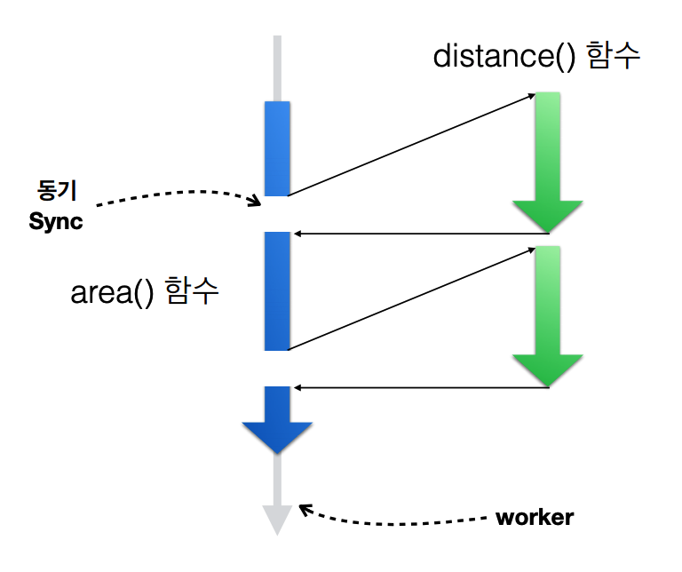
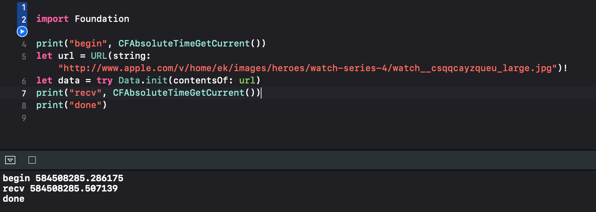
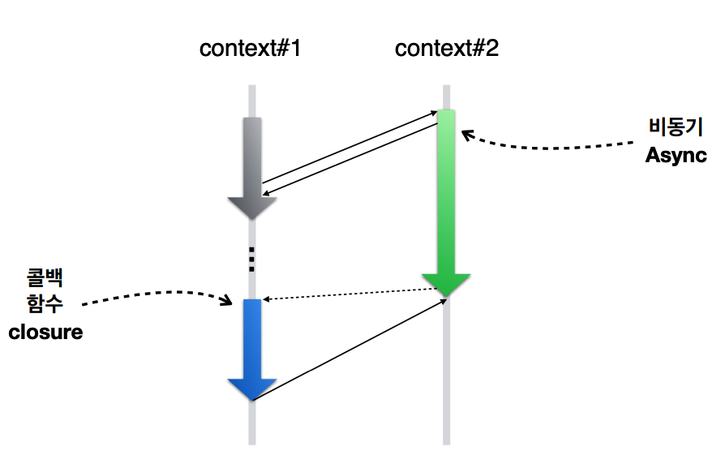

**PSTN**

✻ Public Switched Telecommunications Network


**Blue-box**

- 장거리전화 무료 통신 장치


Digital communication

- 전화통신은 end point 사이에 유선 연결이 필요
- Node와 Node 사이에 여러 라우터를 두고 packet 단위의 정보를 주고받는다.
  - Node는 인접한 router에 다른 End pointer로 보낼 패킷을 전달
  - 패킷을 수신한 router는 packet에 포함된 목적 주소(라우터)로 해당 패킷을 전달함
  - 패킷을 한번에 보낼 대역폭(bandwidth)에 따라 얼마나 많은 Node 간의 통신이 가능한지가 결정됨.

IETF

- 컴퓨터 통신에 대한 표준을 제정하는 기관
- HTTP, HTTPS, DHCP, IPv6, MIME, SMTP, SNMP, TCP, UDP, IP, RIP, FTP, ARP, DOMAIN 등

- Socket, Transmission Control, Domain Name, Secure Shell, URL, TCP Connection, File Transfer, Address Resolution, Sessen Initiation, ….

### Network Tools

터미널 명령어 

- ifconfig, netstat, ping(서버 네트워크의 응답 여부 측정), nslookup(요청에 응답하는 서버가 몇개가 있는지), traceroute, whois, finger(거의 안씀), nc, arp, nettop, route 

[예]

```swi
sMacBook-Pro-3:~ hw$ nslookup www.apple.com
Server:		192.168.1.1
Address:	192.168.1.1#53

Non-authoritative answer:
www.apple.com	canonical name = www.apple.com.edgekey.net.
www.apple.com.edgekey.net	canonical name = www.apple.com.edgekey.net.globalredir.akadns.net.
www.apple.com.edgekey.net.globalredir.akadns.net	canonical name = e6858.dsce9.akamaiedge.net.
Name:	e6858.dsce9.akamaiedge.net
Address: 104.74.172.164
```


### Network Socket

- TCP 최초 구현한 방식은 아래와 같다.
  - 3-way handshake / 4-way handshake
- BSD (Berkely Socket Distributed)의 도식도


### iOS Networking

| Application          |
| -------------------- |
| **Foundation**       |
| **CFNetwork**        |
| **Core OS (Darwin)** |

소켓 통신은 Core OS (Darwin) 레벨에서 구현가능

CFNetwork (Core Foundation - C로 구현)

통상 Foundation에서 제공하는 APIs 를 사용할 것을 권장


### 7가지 주요 network 개념

- Security (네트워크 보안)
- Packet problems (패킷간 순서 보장 등)
- Bandwidth (대역폭, 얼마나 자주 보낼 수 있는지)
- Latency (응답속도. 거리와 서버의 성능등에 따라 다름)
- Service Discovery Protocol (port;응답을 주고받는 소켓의 번호를 찾는 프로토콜)
- Asymmetric Connectivity (비대칭 연결)
  - server side - n개 client와 연결 후 응답 시 발생하는 대기현상에 대해

- Mobility  (휴대폰과 같이 움직일 때 마다 ip가 바뀌는 device를 이용한 통신)


### Darwin (OS)

- C API
- WWAN interface :  3G/4G 등 네트워크에 대한 선택이 불가...


### CFNetwork

- C API
- WWAN activation : 네트워크 주파수 선택 가능
- 네트워크 보안을 포함
- 여러 Protocols에 대한 선택적 사용이 가능


### Foundation (권장 접근 방식)

- Objective-C & Swift
- 여러 Protocols에 대한 선택적 사용이 가능
  - HTTP/HTTPS : 범용성. 클라이언트가 요청시에만 연결되어 서버로부터 응답 받음
    - Foundation > NSURLConnection 으로 사용
  - TCP : Connection 연결 후 원할 때 마다 요청/응답을 주고받음.
    -  서버가 push할 때도 클라이언트에서 바로 연결 가능
    - Foundation > NSStream으로 사용
  - UDP : Connection을 따로 두지 않음
    - 데이터를 보낼 상대에게 커넥션 없이 데이터를 지속적으로 보냄
    - 동영상 전송시 적합.
      - youtube를 키고 끄는것에 대해서는 TCP/HTTPS로 구현
      - 영상의 재생/정지는 UDP를 따름


### NSURLConnection (iOS 9 까지만 제공)

- http/https에 적합한 API
- Asynchronous event-based API 
- 기능
  - Persistent connections (세션 연결 유지)
  - Pipelining (이어받기)
  - Authentication (인증) 
  - Caching (URL 캐쉬)
  - Cookies (쿠키)
  - SOCKS and HTTP proxy (프록시)

- **NSURLSession**이나 **Network.Framework**으로 대체 
  - [Introducing Network.framework: A modern alternative to Sockets](https://developer.apple.com/videos/play/wwdc2018/715/)
  - [Framework - Network](https://developer.apple.com/documentation/network)
  - [About Networking](https://developer.apple.com/library/archive/documentation/NetworkingInternetWeb/Conceptual/NetworkingOverview/Introduction/Introduction.html)


### URL Request

- 별도 세팅 없으면 HTTP method가 `GET`으로  설정됨


### URL Response

- Header와 Body로 나뉨
- Body에 `<html>` 등과 같은 정보가 온다
  - header에서 body의 content-length 정보를 담고 있어야 한다. 
    - packet단위로 정보를 보내므로 처음~마지막 정보 길이를 알아야한다.


### Clock

- 수정체(crystal)을 활용하여 반복적으로 부품이 작동(Rising / Falling)하는 주기를 갖는다.
- Clock-width : Rising edge와 Falling edge 사이의 간격
- Clock period : clock이 rise -> fall -> wait —> 다시 rise 하기 전의 주기


### Synchronous

> 타이밍을 맞춘다
>
> (누가) (누구와) 타이밍이 맞을때까지 기다린다.



- 전자공학 : Clock을 기준으로, clock이 뛰는 시점에 어떤 회로에 정기적인 것이 켜져있느냐 아니냐에 따라 작동여부가 달라진다.
  - CLK과 IN의 타이밍이 맞을 때를 기다려서 X를 만들어 낸다.
- 프로그래밍의 간접참조(indirection)의 동기방식도 위와 같다. 

```swift
///subroutine
func distance(_ p1 : Int, _ p2 : Int) -> Int {
	return abs(p2 - p2)
}
///Routine
func area(x1 : Int, y1 : Int, x2 : Int, y2 : Int) -> Int {
	let dX = distance(x1, x2)	
	let dY = distance(y1, y2)	//간접참조를 통해 서브루틴인 distance(x1, x2)의 작동이 완료/리턴될 때까지 대기한다.
	return dX * dY
}
```

- 네트워크에서 동기함수로 작동하는 Data 객체 생성자함수 작동시

```swift
import Foundation
print("begin", CFAbsoluteTimeGetCurrent())
let url = URL(string: "http://www.apple.com/v/home/ek/images/heroes/watch-series-4/watch__csqqcayzqueu_large.jpg")!
let data = try Data.init(contentsOf: url)	/// synchronous
print("recieved", CFAbsoluteTimeGetCurrent())
print("done")

```




## 비동기



`context#1`에서 `context#2`로 비동기 서브루틴 실행

`context#1`은 이후에 다른 작업을 시행 (`context#2`의 작업 시작 전 즉시 리턴 받기 가능)

`context#2`로부터 결과값을 받을 콜백함수에 완료된 시점에 `push`


## Reactive Programming

### Sync & One : T 

- 서브루틴의 종료시 메인루틴에 T를 준다.

### Async & One : Future [T]

- 미래 어느 순간에 T를 준다.
- 상대(다른 객체)가 나에게 T를 준다.

### Async & Many : Observable[T]

- Future[T]를 주는 시점이 여러개 존재. 하나만 줄수도, 한번에 몇개씩 줄 수도..
- 요청 하나에 비동기 응답이 여러개 올 수 있다.


[iOS ) GCD - Dispatch Queue사용법 (1)](https://zeddios.tistory.com/516)

[Swift. GCD 기초 정리하기 1](https://devmjun.github.io/archive/1-GCD)

[자바스크립트의 Async/Await 가 Promises를 사라지게 만들 수 있는 6가지 이유](https://medium.com/@constell99/자바스크립트의-async-await-가-promises를-사라지게-만들-수-있는-6가지-이유-c5fe0add656c)


